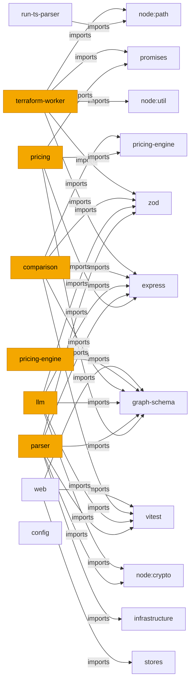

```mermaid
flowchart LR
  __infrastructure["infrastructure"]
  __stores["stores"]
  _terraform_viz_graph_schema["graph-schema"]
  _terraform_viz_pricing_engine["pricing-engine"]
  apps_terraform_worker["terraform-worker"]
  apps_web["web"]
  express["express"]
  node_crypto["node:crypto"]
  node_fs_promises["promises"]
  node_path["node:path"]
  node_util["node:util"]
  packages_pricing_engine["pricing-engine"]
  scripts_run_ts_parser["run-ts-parser"]
  services_comparison["comparison"]
  services_llm["llm"]
  services_parser["parser"]
  services_pricing["pricing"]
  vitest["vitest"]
  vitest_config["config"]
  zod["zod"]

  apps_terraform_worker -->|imports| express
  apps_terraform_worker -->|imports| node_fs_promises
  apps_terraform_worker -->|imports| node_path
  apps_terraform_worker -->|imports| node_util
  apps_terraform_worker -->|imports| zod
  apps_web -->|imports| __stores
  apps_web -->|imports| _terraform_viz_graph_schema
  apps_web -->|imports| vitest
  packages_pricing_engine -->|imports| _terraform_viz_graph_schema
  scripts_run_ts_parser -->|imports| node_path
  services_comparison -->|imports| _terraform_viz_graph_schema
  services_comparison -->|imports| _terraform_viz_pricing_engine
  services_comparison -->|imports| express
  services_comparison -->|imports| vitest
  services_comparison -->|imports| zod
  services_llm -->|imports| _terraform_viz_graph_schema
  services_llm -->|imports| express
  services_llm -->|imports| node_crypto
  services_llm -->|imports| vitest
  services_llm -->|imports| zod
  services_parser -->|imports| __infrastructure
  services_parser -->|imports| _terraform_viz_graph_schema
  services_parser -->|imports| express
  services_parser -->|imports| node_crypto
  services_parser -->|imports| vitest
  services_parser -->|imports| zod
  services_pricing -->|imports| _terraform_viz_graph_schema
  services_pricing -->|imports| _terraform_viz_pricing_engine
  services_pricing -->|imports| express
  services_pricing -->|imports| node_fs_promises

  style apps_terraform_worker fill:#f4a700,stroke:#c47d00,color:#000
  style packages_pricing_engine fill:#f4a700,stroke:#c47d00,color:#000
  style services_comparison fill:#f4a700,stroke:#c47d00,color:#000
  style services_llm fill:#f4a700,stroke:#c47d00,color:#000
  style services_parser fill:#f4a700,stroke:#c47d00,color:#000
  style services_pricing fill:#f4a700,stroke:#c47d00,color:#000
```
