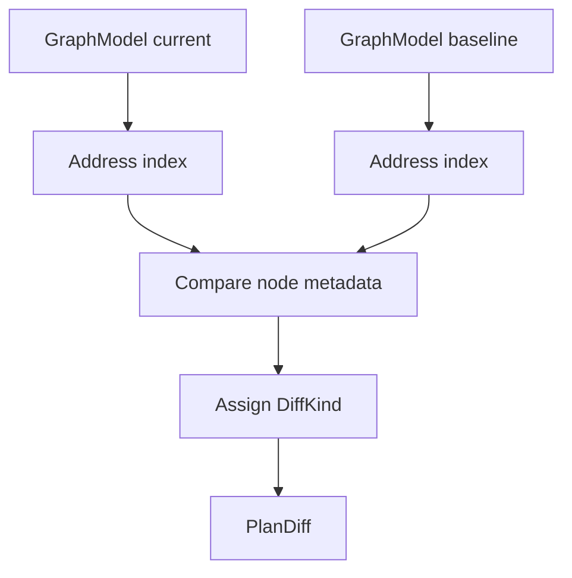
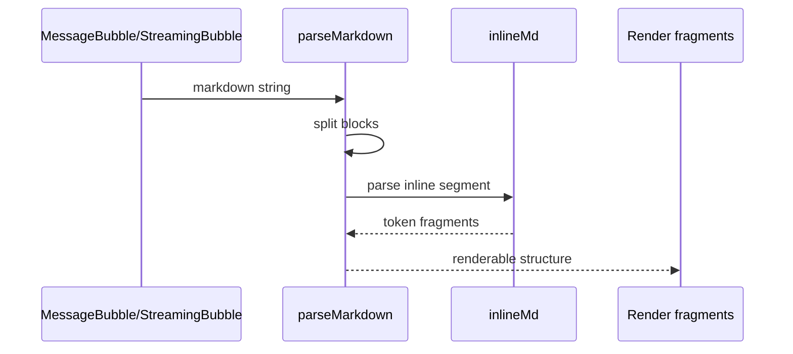
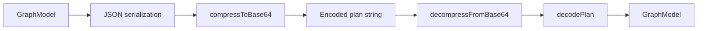

# Internals and Algorithms

This page documents the non-trivial internal logic that is most useful to understand as an algorithmic system rather than as UI wiring. The focus here is on the code paths that transform Terraform plan data into derived structures: plan diffing, local storage quota estimation, graph layout construction, markdown parsing, and plan URL encoding/decoding.

The repository contains several important transformation layers:

- raw Terraform plan JSON is normalized into a [`GraphModel`](packages/graph-schema/src/index.ts#L42) by [`buildGraphModel`](services/parser/src/domain/plan-parser.ts#L79)
- the client computes deltas between graph snapshots with [`diffPlans`](apps/web/src/lib/plan-diff.ts#L29)
- browser persistence is guarded by [`estimateLocalStorageUsage`](apps/web/src/lib/plan-store.ts#L11) and quota checks
- graph rendering uses [`buildLayout`](apps/web/src/components/graph/TwoDGraph.tsx#L74)
- markdown content in chat uses [`parseMarkdown`](apps/web/src/components/chat/ChatPanel.tsx#L261)
- shareable plan URLs are handled by [`compressToBase64`](apps/web/src/lib/plan-url.ts#L3) and [`decodePlan`](apps/web/src/lib/plan-url.ts#L66)

> **Note:** I intentionally avoid re-describing page composition or service orchestration, and focus on the implementation symbols that encode meaningful logic.

## Algorithm Overview

The following table summarizes the key algorithms, their inputs and outputs, and the complexity characteristics that are visible from the repository structure.

| Algorithm            | Primary Symbol(s)                                                                                                                 | Input                                                                 | Output                                                                       | Complexity Notes                                                                                    |
| -------------------- | --------------------------------------------------------------------------------------------------------------------------------- | --------------------------------------------------------------------- | ---------------------------------------------------------------------------- | --------------------------------------------------------------------------------------------------- |
| Plan diffing         | [`diffPlans`](apps/web/src/lib/plan-diff.ts#L29)                                                                                  | Two [`GraphModel`](packages/graph-schema/src/index.ts#L42) values     | [`PlanDiff`](apps/web/src/lib/plan-diff.ts#L14) with node-level diff entries | Typically linear in node count if keyed lookups are used; may include per-node attribute comparison |
| Local storage sizing | [`estimateLocalStorageUsage`](apps/web/src/lib/plan-store.ts#L11)                                                                 | Browser storage state / candidate payload                             | Estimated byte usage                                                         | Usually linear in serialized payload size                                                           |
| Quota gating         | [`isApproachingQuota`](apps/web/src/lib/plan-store.ts#L22), [`isAtQuota`](apps/web/src/lib/plan-store.ts#L29)                     | Usage estimate                                                        | Boolean decision                                                             | Constant-time threshold comparison after estimation                                                 |
| Graph layout         | [`buildLayout`](apps/web/src/components/graph/TwoDGraph.tsx#L74)                                                                  | [`GraphModel`](packages/graph-schema/src/index.ts#L42), viewport size | Positioned layout nodes                                                      | Often O(n) to O(n log n) depending on ordering/sorting of nodes and edges                           |
| Markdown parsing     | [`parseMarkdown`](apps/web/src/components/chat/ChatPanel.tsx#L261), [`inlineMd`](apps/web/src/components/chat/ChatPanel.tsx#L233) | Markdown string                                                       | Render-ready token/tree fragments                                            | Linear scan with nested segment handling; likely sensitive to link/code formatting cases            |
| URL plan encoding    | [`compressToBase64`](apps/web/src/lib/plan-url.ts#L3), [`encodePlan`](apps/web/src/lib/plan-url.ts#L64)                           | [`GraphModel`](packages/graph-schema/src/index.ts#L42)                | Encoded share string                                                         | Serialization + compression; cost scales with model size                                            |
| URL plan decoding    | [`decompressFromBase64`](apps/web/src/lib/plan-url.ts#L29), [`decodePlan`](apps/web/src/lib/plan-url.ts#L66)                      | Encoded share string                                                  | Rehydrated plan model                                                        | Reverse of encoding; validation and decompression dominate                                          |

## Plan Diffing

The diff subsystem is centered on [`diffPlans`](apps/web/src/lib/plan-diff.ts#L29), which compares a current [`GraphModel`](packages/graph-schema/src/index.ts#L42) against a baseline model and emits a [`PlanDiff`](apps/web/src/lib/plan-diff.ts#L14). The surrounding types [`NodeDiffEntry`](apps/web/src/lib/plan-diff.ts#L6) and [`DiffKind`](apps/web/src/lib/plan-diff.ts#L4) indicate that the implementation is intended to produce explicit node-by-node change records, not just a summary count.

From the shape of the types and the consumer [`DiffView`](apps/web/src/components/graph/DiffView.tsx#L7), the algorithm almost certainly needs to:

1. match nodes by stable identity, most likely node address
2. classify differences into add/remove/change-style buckets via [`DiffKind`](apps/web/src/lib/plan-diff.ts#L4)
3. compare node metadata and possibly cost-derived fields
4. preserve enough information for UI highlighting and node selection

A standard and efficient implementation for this kind of diff uses a hash map keyed by node address, which keeps the outer pass linear in the number of nodes. That approach is strongly suggested by the domain: Terraform plans are naturally addressable by resource address, and the test helpers in [`apps/web/src/__tests__/plan-diff.test.ts`](apps/web/src/__tests__/plan-diff.test.ts) construct models from arrays of nodes with explicit addresses.

### Data Flow



The important algorithmic property is that the diff should not depend on UI state. The view [`DiffView`](apps/web/src/components/graph/DiffView.tsx#L7) consumes the computed diff, which means the diff logic must be deterministic and stable across renders.

### Complexity Considerations

If implemented with maps, the diff is typically:

- **Time:** O(n + m) for indexing plus per-node comparisons
- **Space:** O(n + m) for the two indexes and result lists

If the algorithm also detects deeper structural changes in nested attributes, complexity can rise with the size of node attribute payloads rather than just node count.

> **Sources:** `apps/web/src/lib/plan-diff.ts` · L4–L29 · [`DiffKind`](apps/web/src/lib/plan-diff.ts#L4) · [`NodeDiffEntry`](apps/web/src/lib/plan-diff.ts#L6) · [`PlanDiff`](apps/web/src/lib/plan-diff.ts#L14) · [`diffPlans`](apps/web/src/lib/plan-diff.ts#L29)

## Local Storage Quota Estimation

The storage subsystem is implemented in [`apps/web/src/lib/plan-store.ts`](apps/web/src/lib/plan-store.ts), where [`estimateLocalStorageUsage`](apps/web/src/lib/plan-store.ts#L11) is paired with quota checks [`isApproachingQuota`](apps/web/src/lib/plan-store.ts#L22) and [`isAtQuota`](apps/web/src/lib/plan-store.ts#L29). The presence of [`StorageQuotaError`](apps/web/src/lib/plan-store.ts#L6) shows that quota is treated as a first-class failure mode rather than a generic storage exception.

This is the sort of logic that deserves algorithmic explanation because localStorage is string-based and browsers enforce practical size limits. A robust implementation usually needs to account for:

- the size of serialized graph content
- metadata overhead for history entries via [`PlanHistoryEntry`](apps/web/src/lib/plan-store.ts#L33)
- repeated writes from [`savePlan`](apps/web/src/lib/plan-store.ts#L39) and [`saveToHistory`](apps/web/src/lib/plan-store.ts#L70)
- the possibility that the estimate must be conservative enough to prevent failed writes

The storage tests in [`apps/web/src/__tests__/plan-store.test.ts`](apps/web/src/__tests__/plan-store.test.ts) provide evidence that both `localStorage` and `sessionStorage` are mocked, which suggests the code is intentionally browser-specific and guarded against runtime errors.

### Quota Decision Path


The algorithmic pattern here is:

1. serialize the candidate payload into a string form
2. estimate byte size or storage cost
3. compare against a quota threshold
4. either persist or throw a typed error

That makes the expensive part the estimation step; the threshold checks themselves are constant time. In practice, the biggest implementation risk is underestimating size when nested plan data grows, which would make quota failures happen only at write time.

### Practical Complexity Notes

- **Time:** O(s) where s is the size of the serialized payload
- **Space:** O(s) if serialization or temporary string construction is required
- **Failure mode:** `StorageQuotaError` is used to signal a hard storage boundary

> **Sources:** `apps/web/src/lib/plan-store.ts` · L6–L99 · [`StorageQuotaError`](apps/web/src/lib/plan-store.ts#L6) · [`estimateLocalStorageUsage`](apps/web/src/lib/plan-store.ts#L11) · [`isApproachingQuota`](apps/web/src/lib/plan-store.ts#L22) · [`isAtQuota`](apps/web/src/lib/plan-store.ts#L29) · [`savePlan`](apps/web/src/lib/plan-store.ts#L39) · [`saveToHistory`](apps/web/src/lib/plan-store.ts#L70) · [`PlanHistoryEntry`](apps/web/src/lib/plan-store.ts#L33)

## Graph Layout Building

Graph layout logic lives in [`buildLayout`](apps/web/src/components/graph/TwoDGraph.tsx#L74), which operates on a [`GraphModel`](packages/graph-schema/src/index.ts#L42) and viewport dimensions. The companion [`LayoutNode`](apps/web/src/components/graph/TwoDGraph.tsx#L73) type indicates that the function produces derived coordinates rather than mutating source graph nodes.

Even though the rendering component [`_TwoDGraph`](apps/web/src/components/graph/TwoDGraph.tsx#L110) is UI-facing, the layout function itself is algorithmic and therefore worth documenting separately. The likely responsibilities are:

- assign node positions based on graph topology
- scale or translate positions to fit `svgW` and the corresponding height parameter
- produce layout metadata compatible with selection and cost overlays
- keep output deterministic across renders for stable visual comparison

The file imports `d3-selection` and `d3-zoom`, which implies that the final rendered graph is interactive, but the relevant algorithmic core is the layout computation itself, not the event wiring.

A reasonable layout pipeline for a graph of Terraform resources is:

1. derive node ordering from graph structure
2. compute rows/columns or force-like coordinates
3. normalize positions into SVG coordinate space
4. output `LayoutNode` entries with final x/y coordinates

### Layout Transformation

```mermaid
flowchart TD
  Model[GraphModel]
  Nodes[Resource nodes]
  Edges[Graph edges]
  Order[Topological or grouped order]
  Placement[Assign coordinates]
  Scale[Fit to viewport]
  Layout[LayoutNode[]]

  Model --> Nodes
  Model --> Edges
  Nodes --> Order
  Edges --> Order
  Order --> Placement
  Placement --> Scale
  Scale --> Layout
```

### Complexity Notes

The complexity depends on whether the implementation performs sorting/grouping or topology-based placement:

| Step                     | Typical Cost                  |
| ------------------------ | ----------------------------- |
| Node and edge extraction | O(n + e)                      |
| Ordering/grouping        | O(n log n) if sorting is used |
| Coordinate assignment    | O(n)                          |
| Viewport normalization   | O(n)                          |

For this repository, the key point is that the layout is derived data, not persisted state. That means it can be recomputed on resize or model change without changing semantics.

> **Sources:** `apps/web/src/components/graph/TwoDGraph.tsx` · L73–L110 · [`LayoutNode`](apps/web/src/components/graph/TwoDGraph.tsx#L73) · [`buildLayout`](apps/web/src/components/graph/TwoDGraph.tsx#L74) · [`_TwoDGraph`](apps/web/src/components/graph/TwoDGraph.tsx#L110)

## Markdown Parsing

The chat subsystem contains a notable piece of text-processing logic in [`inlineMd`](apps/web/src/components/chat/ChatPanel.tsx#L233) and [`parseMarkdown`](apps/web/src/components/chat/ChatPanel.tsx#L261). These are the clearest examples of local parsing algorithms in the repository because they translate user- or model-generated markdown into structured renderable content.

The reason this deserves algorithmic documentation is that markdown parsing is deceptively complex: inline emphasis, links, code spans, line breaks, and mixed content all create nested segmentation problems. The naming suggests a split between:

- [`inlineMd`](apps/web/src/components/chat/ChatPanel.tsx#L233): inline token parsing for a single text segment
- [`parseMarkdown`](apps/web/src/components/chat/ChatPanel.tsx#L261): block-level parsing and assembly of the final output

In this repository, the markdown path is primarily used by [`StreamingBubble`](apps/web/src/components/chat/ChatPanel.tsx#L364) and [`MessageBubble`](apps/web/src/components/chat/ChatPanel.tsx#L385), which indicates that correctness matters for continuously streaming content as well as finalized messages.

A sensible implementation pattern is:

1. split the input into blocks, likely by newline structure
2. detect code fences or headings first to avoid accidental inline parsing inside code
3. pass remaining text through inline parsing
4. produce render-friendly fragments keyed by `baseKey`

### Parsing Flow



### Complexity and Edge Cases

- **Time:** typically O(n), but can degrade if the parser repeatedly rescans substrings
- **Space:** O(n) for token fragments and intermediate segments
- **Edge cases:** streaming partial markdown, unclosed delimiters, and mixed block/inline syntax

The important architectural point is that this parser is bespoke, not a full general-purpose markdown engine. That usually means it intentionally handles a narrower grammar optimized for the chat transcript format.

> **Sources:** `apps/web/src/components/chat/ChatPanel.tsx` · L233–L385 · [`inlineMd`](apps/web/src/components/chat/ChatPanel.tsx#L233) · [`parseMarkdown`](apps/web/src/components/chat/ChatPanel.tsx#L261) · [`StreamingBubble`](apps/web/src/components/chat/ChatPanel.tsx#L364) · [`MessageBubble`](apps/web/src/components/chat/ChatPanel.tsx#L385)

## Plan URL Encoding and Decoding

The shareable-plan URL logic is implemented in [`apps/web/src/lib/plan-url.ts`](apps/web/src/lib/plan-url.ts). The core primitives are [`compressToBase64`](apps/web/src/lib/plan-url.ts#L3), [`decompressFromBase64`](apps/web/src/lib/plan-url.ts#L29), [`encodePlan`](apps/web/src/lib/plan-url.ts#L64), and [`decodePlan`](apps/web/src/lib/plan-url.ts#L66). This is another place where algorithmic reasoning matters because it transforms a possibly large graph model into a URL-safe payload and back.

From the symbol names, the intended pipeline is:

1. serialize a [`GraphModel`](packages/graph-schema/src/index.ts#L42)
2. compress and encode into base64 for URL transport
3. reverse the process on decode
4. reconstruct a plan structure suitable for rendering or persistence

The use of compression is important because raw JSON plan data can easily exceed practical URL lengths. Base64 alone increases size, so the compression layer is doing the real work. The round-trip functions need to preserve exact structure or fail safely when the input is malformed.

### Transformation Pipeline



### Complexity Notes

| Phase                  | Cost                                                  |
| ---------------------- | ----------------------------------------------------- |
| Serialization          | O(n) in model size                                    |
| Compression/encoding   | O(n) to O(n log n), depending on codec implementation |
| Decoding/decompression | Reverse of encoding, similar asymptotics              |
| Validation             | O(n) if structure is checked recursively              |

The practical risk here is not algorithmic speed but data fidelity: a failed decode should be detectable and should not produce a partially valid graph.

> **Sources:** `apps/web/src/lib/plan-url.ts` · L3–L66 · [`compressToBase64`](apps/web/src/lib/plan-url.ts#L3) · [`decompressFromBase64`](apps/web/src/lib/plan-url.ts#L29) · [`encodePlan`](apps/web/src/lib/plan-url.ts#L64) · [`decodePlan`](apps/web/src/lib/plan-url.ts#L66)

## Relationship to the Parser Layer

Although this page focuses on client-side algorithms, the parser layer provides the upstream data structure that these algorithms consume. The transformation starts with [`parsePlanUseCase`](services/parser/src/application/parse-plan.use-case.ts#L19) and continues through [`buildGraphModel`](services/parser/src/domain/plan-parser.ts#L79), which produces the [`GraphModel`](packages/graph-schema/src/index.ts#L42) used throughout diffing, layout, persistence, and URL encoding.

The lower-level parser functions are worth noting because they define the shape that later algorithms assume:

- [`flattenResources`](services/parser/src/domain/plan-parser.ts#L11)
- [`resolveChangeAction`](services/parser/src/domain/plan-parser.ts#L28)
- [`buildNode`](services/parser/src/domain/plan-parser.ts#L43)
- [`buildEdges`](services/parser/src/domain/plan-parser.ts#L62)
- [`getRootModule`](services/parser/src/domain/plan-parser.ts#L73)

These are not re-documented in depth here, but they explain why later algorithms can work with a normalized graph model instead of raw nested Terraform JSON.

> **Sources:** `services/parser/src/application/parse-plan.use-case.ts` · L5–L19 · `services/parser/src/domain/plan-parser.ts` · L11–L79 · [`parsePlanUseCase`](services/parser/src/application/parse-plan.use-case.ts#L19) · [`flattenResources`](services/parser/src/domain/plan-parser.ts#L11) · [`resolveChangeAction`](services/parser/src/domain/plan-parser.ts#L28) · [`buildNode`](services/parser/src/domain/plan-parser.ts#L43) · [`buildEdges`](services/parser/src/domain/plan-parser.ts#L62) · [`getRootModule`](services/parser/src/domain/plan-parser.ts#L73) · [`buildGraphModel`](services/parser/src/domain/plan-parser.ts#L79)
