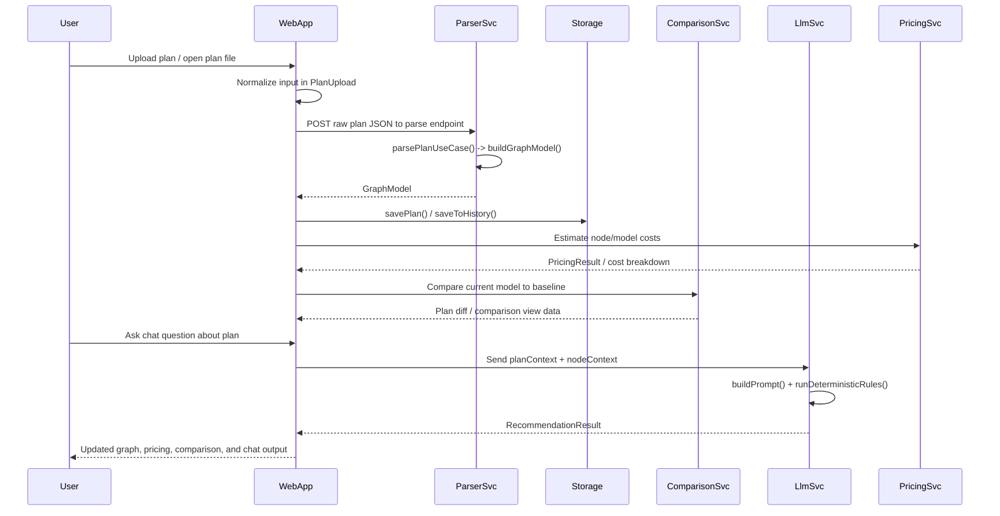

# End-to-End Product Data Flow

## Overview

This page traces the product’s primary data path from Terraform plan upload through parsing, graph creation, local persistence, chat/LLM interaction, and pricing/comparison updates. The architecture is centered on a shared graph representation, [`GraphModel`](packages/graph-schema/src/index.ts#L42), which is produced by the parser service, stored in the web app, and then consumed by the pricing, comparison, and chat features. The web layer acts as the orchestration boundary: it accepts uploaded plan artifacts, normalizes them into a graph, persists them locally when needed, and fans the graph out to visualization, cost estimation, diffing, and LLM-assisted recommendations.

At a high level, the product supports two major flows:

1. **Ingestion flow** — upload or open a plan, parse it into a graph, persist it, and render it in the UI.
2. **Analysis flow** — derive cost estimates, compare against baselines, and send graph context to the chat/LLM service for recommendations.

The main entry points that participate in this path include the web routes [`POST`](apps/web/src/app/api/parse/route.ts#L5), [`POST`](apps/web/src/app/api/run/route.ts#L12), and [`POST`](apps/web/src/app/api/chat/route.ts#L9), plus the parser, pricing, comparison, and LLM services (`services/parser/src/main.ts`, `services/pricing/src/main.ts`, `services/comparison/src/main.ts`, `services/llm/src/main.ts`). The browser-facing graph page [`GraphPage`](apps/web/src/app/graph/page.tsx#L32) wires these pieces together.

> **Sources:** `apps/web/src/app/graph/page.tsx` · L32 · [`GraphPage`](apps/web/src/app/graph/page.tsx#L32) · `packages/graph-schema/src/index.ts` · L42 · [`GraphModel`](packages/graph-schema/src/index.ts#L42) · `apps/web/src/app/api/parse/route.ts` · L5 · [`POST`](apps/web/src/app/api/parse/route.ts#L5) · `apps/web/src/app/api/run/route.ts` · L12 · [`POST`](apps/web/src/app/api/run/route.ts#L12) · `apps/web/src/app/api/chat/route.ts` · L9 · [`POST`](apps/web/src/app/api/chat/route.ts#L9)

## End-to-End Flow

The diagram above shows the typical “happy path” for a plan entering the product. The upload step starts in the web UI via [`PlanUpload`](apps/web/src/components/upload/PlanUpload.tsx#L14), which can source a plan from file input or a Tauri bridge (`apps/web/src/lib/tauri-bridge.ts`). The web layer then posts the raw payload to the parser route [`POST`](apps/web/src/app/api/parse/route.ts#L5), which forwards to the parser service’s [`parsePlanUseCase`](services/parser/src/application/parse-plan.use-case.ts#L19). That use case validates the input with [`isTerraformPlan`](services/parser/src/application/parse-plan.use-case.ts#L9), converts the Terraform plan into a graph with [`buildGraphModel`](services/parser/src/domain/plan-parser.ts#L79), and returns the canonical graph shape.

Once the model is returned, the web app persists it locally using [`savePlan`](apps/web/src/lib/plan-store.ts#L39) and may also append a history snapshot with [`saveToHistory`](apps/web/src/lib/plan-store.ts#L70). The same model then feeds pricing logic through [`estimateCost`](packages/pricing-engine/src/estimator.ts#L6) / [`totalMonthlyCost`](packages/pricing-engine/src/estimator.ts#L18), and comparison logic through [`diffPlans`](apps/web/src/lib/plan-diff.ts#L29). When the user opens the chat panel, [`planContext`](apps/web/src/components/chat/ChatPanel.tsx#L49) and [`nodeContext`](apps/web/src/components/chat/ChatPanel.tsx#L65) package the graph into a prompt-friendly representation that the LLM service turns into a response via [`buildPrompt`](services/llm/src/main.ts#L44) and [`callLlm`](services/llm/src/main.ts#L28).

> **Sources:** `apps/web/src/components/upload/PlanUpload.tsx` · L14 · [`PlanUpload`](apps/web/src/components/upload/PlanUpload.tsx#L14) · `apps/web/src/app/api/parse/route.ts` · L5 · [`POST`](apps/web/src/app/api/parse/route.ts#L5) · `services/parser/src/application/parse-plan.use-case.ts` · L9–L19 · [`isTerraformPlan`](services/parser/src/application/parse-plan.use-case.ts#L9) · [`parsePlanUseCase`](services/parser/src/application/parse-plan.use-case.ts#L19) · `services/parser/src/domain/plan-parser.ts` · L79 · [`buildGraphModel`](services/parser/src/domain/plan-parser.ts#L79) · `apps/web/src/lib/plan-store.ts` · L39–L70 · [`savePlan`](apps/web/src/lib/plan-store.ts#L39) · [`saveToHistory`](apps/web/src/lib/plan-store.ts#L70) · `packages/pricing-engine/src/estimator.ts` · L6–L18 · [`estimateCost`](packages/pricing-engine/src/estimator.ts#L6) · [`totalMonthlyCost`](packages/pricing-engine/src/estimator.ts#L18) · `apps/web/src/lib/plan-diff.ts` · L29 · [`diffPlans`](apps/web/src/lib/plan-diff.ts#L29) · `apps/web/src/components/chat/ChatPanel.tsx` · L49–L65 · [`planContext`](apps/web/src/components/chat/ChatPanel.tsx#L49) · [`nodeContext`](apps/web/src/components/chat/ChatPanel.tsx#L65) · `services/llm/src/main.ts` · L28–L44 · [`callLlm`](services/llm/src/main.ts#L28) · [`buildPrompt`](services/llm/src/main.ts#L44)

## Step-by-Step Narrative

### 1. Plan upload and input normalization

The entry point for user-submitted plans is [`PlanUpload`](apps/web/src/components/upload/PlanUpload.tsx#L14). This component accepts the user’s artifact and prepares it for downstream processing. The web app also supports opening files through [`openPlanFile`](apps/web/src/lib/tauri-bridge.ts#L40) and applies environment-specific checks through [`isTauri`](apps/web/src/lib/tauri-bridge.ts#L11). At this stage, the system is not yet interpreting the plan semantically; it is only capturing and packaging the raw artifact.

### 2. Parsing into a graph

The parsing boundary is the web route [`POST`](apps/web/src/app/api/parse/route.ts#L5), which uses the shared graph contract [`GraphModel`](packages/graph-schema/src/index.ts#L42). On the server side, the parser service first verifies the payload with [`isTerraformPlan`](services/parser/src/application/parse-plan.use-case.ts#L9), then builds the graph through [`parsePlanUseCase`](services/parser/src/application/parse-plan.use-case.ts#L19) and [`buildGraphModel`](services/parser/src/domain/plan-parser.ts#L79). The graph parser performs three key transformations:

- flattens nested modules with [`flattenResources`](services/parser/src/domain/plan-parser.ts#L11),
- computes lifecycle/change semantics with [`resolveChangeAction`](services/parser/src/domain/plan-parser.ts#L28),
- creates canonical graph nodes and edges with [`buildNode`](services/parser/src/domain/plan-parser.ts#L43) and [`buildEdges`](services/parser/src/domain/plan-parser.ts#L62).

Resource metadata is also classified by provider and layer using [`classifyResource`](services/parser/src/domain/layer-classifier.ts#L271) and its provider-specific helpers, which normalize resource types into the graph schema.

### 3. Persistence and retrieval

Once parsing succeeds, the web app persists the resulting model via [`savePlan`](apps/web/src/lib/plan-store.ts#L39). The store also supports:

- quota estimation with [`estimateLocalStorageUsage`](apps/web/src/lib/plan-store.ts#L11),
- quota warnings with [`isApproachingQuota`](apps/web/src/lib/plan-store.ts#L22) and [`isAtQuota`](apps/web/src/lib/plan-store.ts#L29),
- history snapshots through [`saveToHistory`](apps/web/src/lib/plan-store.ts#L70),
- model recovery with [`loadPlan`](apps/web/src/lib/plan-store.ts#L54) and [`loadHistory`](apps/web/src/lib/plan-store.ts#L93).

This persistence layer is local-first: the observable storage mechanisms in the code are browser local/session storage, not a database. The UI surfaces this constraint through [`StorageWarningBanner`](apps/web/src/components/ui/StorageWarningBanner.tsx#L5) and the plan store’s quota error type [`StorageQuotaError`](apps/web/src/lib/plan-store.ts#L6).

### 4. Graph rendering and interaction

The graph view [`GraphPage`](apps/web/src/app/graph/page.tsx#L32) consumes the persisted [`GraphModel`](packages/graph-schema/src/index.ts#L42) and passes it to the 2D renderer [`_TwoDGraph`](apps/web/src/components/graph/TwoDGraph.tsx#L110). The layout is derived by [`buildLayout`](apps/web/src/components/graph/TwoDGraph.tsx#L74), which transforms graph nodes into view coordinates. Supporting components such as [`NodeDetail`](apps/web/src/components/graph/NodeDetail.tsx#L156), [`GraphFilterBar`](apps/web/src/components/graph/GraphFilterBar.tsx#L60), and [`GraphToolbar`](apps/web/src/components/graph/GraphToolbar.tsx#L11) do not change the core graph schema, but they do reshape how it is consumed: filtering, selecting, pinning a baseline, and loading history entries.

### 5. Pricing and comparison updates

Cost estimation starts with the graph model and node-level usage overrides. The pricing engine exposes [`estimateCost`](packages/pricing-engine/src/estimator.ts#L6), [`totalMonthlyCost`](packages/pricing-engine/src/estimator.ts#L18), and [`costByProvider`](packages/pricing-engine/src/estimator.ts#L26). The web layer can also invoke server-side pricing through [`runPlan`](apps/web/src/lib/server-api.ts#L56) and comparison service calls through [`fetchWithTimeout`](services/comparison/src/main.ts#L8) and [`estimateViaPricingService`](services/comparison/src/main.ts#L32).

Baseline comparison is handled by [`saveBaseline`](apps/web/src/lib/baseline-store.ts#L12), [`loadBaseline`](apps/web/src/lib/baseline-store.ts#L22), [`clearBaseline`](apps/web/src/lib/baseline-store.ts#L31), and the actual diff computation in [`diffPlans`](apps/web/src/lib/plan-diff.ts#L29). The comparison UI surfaces the resulting [`PlanDiff`](apps/web/src/lib/plan-diff.ts#L14) through [`CompareView`](apps/web/src/components/graph/CompareView.tsx#L24) and [`DiffView`](apps/web/src/components/graph/DiffView.tsx#L7).

### 6. Chat and LLM interaction

The chat route [`POST`](apps/web/src/app/api/chat/route.ts#L9) receives a request body shaped by [`RequestBody`](apps/web/src/app/api/chat/route.ts#L3). In the graph view, [`_ChatPanel`](apps/web/src/components/chat/ChatPanel.tsx#L447) collects the current plan context via [`planContext`](apps/web/src/components/chat/ChatPanel.tsx#L49) and node context via [`nodeContext`](apps/web/src/components/chat/ChatPanel.tsx#L65). These are transformed into markdown-like prompt material with [`parseMarkdown`](apps/web/src/components/chat/ChatPanel.tsx#L261) and related helpers, then sent to the LLM service.

On the service side, [`buildClient`](services/llm/src/main.ts#L23) constructs the OpenAI client, [`buildPrompt`](services/llm/src/main.ts#L44) assembles the request, and [`runDeterministicRules`](services/llm/src/rules.ts#L155) injects rule-based findings such as [`checkNoDatabase`](services/llm/src/rules.ts#L11) and [`checkUnencryptedS3`](services/llm/src/rules.ts#L48). The result is a [`RecommendationResult`](packages/llm-types/src/index.ts#L31) that the UI renders in message bubbles.

## Input-to-Output Mapping

| Input artifact               | Primary transformation                                                                                                                                                                      | Output artifact                                                                                                                                                             | Storage / destination                                                                                              |
| ---------------------------- | ------------------------------------------------------------------------------------------------------------------------------------------------------------------------------------------- | --------------------------------------------------------------------------------------------------------------------------------------------------------------------------- | ------------------------------------------------------------------------------------------------------------------ |
| Uploaded Terraform plan JSON | Validated by [`isTerraformPlan`](services/parser/src/application/parse-plan.use-case.ts#L9), normalized by [`parsePlanUseCase`](services/parser/src/application/parse-plan.use-case.ts#L19) | [`GraphModel`](packages/graph-schema/src/index.ts#L42) with [`GraphNode`](packages/graph-schema/src/index.ts#L25) and [`GraphEdge`](packages/graph-schema/src/index.ts#L37) | Returned from parser route, then persisted via [`savePlan`](apps/web/src/lib/plan-store.ts#L39) in browser storage |
| Raw resource/module tree     | Flattened by [`flattenResources`](services/parser/src/domain/plan-parser.ts#L11)                                                                                                            | Linearized resource entries                                                                                                                                                 | Parser service memory during conversion                                                                            |
| Resource change set          | Matched by [`resolveChangeAction`](services/parser/src/domain/plan-parser.ts#L28)                                                                                                           | Per-node change action metadata                                                                                                                                             | Embedded in [`GraphNode`](packages/graph-schema/src/index.ts#L25)                                                  |
| Current graph model          | Estimated with [`estimateCost`](packages/pricing-engine/src/estimator.ts#L6) and [`totalMonthlyCost`](packages/pricing-engine/src/estimator.ts#L18)                                         | Cost estimates / breakdowns                                                                                                                                                 | UI state and pricing views                                                                                         |
| Baseline graph               | Compared with [`diffPlans`](apps/web/src/lib/plan-diff.ts#L29)                                                                                                                              | [`PlanDiff`](apps/web/src/lib/plan-diff.ts#L14)                                                                                                                             | Baseline store via [`saveBaseline`](apps/web/src/lib/baseline-store.ts#L12)                                        |
| Selected node / plan context | Prepared by [`nodeContext`](apps/web/src/components/chat/ChatPanel.tsx#L65) and [`planContext`](apps/web/src/components/chat/ChatPanel.tsx#L49)                                             | LLM prompt text                                                                                                                                                             | Sent to [`callLlm`](services/llm/src/main.ts#L28)                                                                  |
| LLM request                  | Enriched with deterministic checks via [`runDeterministicRules`](services/llm/src/rules.ts#L155)                                                                                            | [`RecommendationResult`](packages/llm-types/src/index.ts#L31)                                                                                                               | Returned to chat UI                                                                                                |

> **Sources:** `services/parser/src/application/parse-plan.use-case.ts` · L9–L19 · [`isTerraformPlan`](services/parser/src/application/parse-plan.use-case.ts#L9) · [`parsePlanUseCase`](services/parser/src/application/parse-plan.use-case.ts#L19) · `packages/graph-schema/src/index.ts` · L25–L42 · [`GraphNode`](packages/graph-schema/src/index.ts#L25) · [`GraphEdge`](packages/graph-schema/src/index.ts#L37) · [`GraphModel`](packages/graph-schema/src/index.ts#L42) · `services/parser/src/domain/plan-parser.ts` · L11–L79 · [`flattenResources`](services/parser/src/domain/plan-parser.ts#L11) · [`resolveChangeAction`](services/parser/src/domain/plan-parser.ts#L28) · [`buildNode`](services/parser/src/domain/plan-parser.ts#L43) · [`buildEdges`](services/parser/src/domain/plan-parser.ts#L62) · [`buildGraphModel`](services/parser/src/domain/plan-parser.ts#L79) · `apps/web/src/lib/plan-store.ts` · L11–L93 · [`estimateLocalStorageUsage`](apps/web/src/lib/plan-store.ts#L11) · [`savePlan`](apps/web/src/lib/plan-store.ts#L39) · [`loadPlan`](apps/web/src/lib/plan-store.ts#L54) · [`saveToHistory`](apps/web/src/lib/plan-store.ts#L70) · `apps/web/src/lib/baseline-store.ts` · L12–L31 · [`saveBaseline`](apps/web/src/lib/baseline-store.ts#L12) · [`loadBaseline`](apps/web/src/lib/baseline-store.ts#L22) · [`clearBaseline`](apps/web/src/lib/baseline-store.ts#L31) · `apps/web/src/lib/plan-diff.ts` · L14–L29 · [`PlanDiff`](apps/web/src/lib/plan-diff.ts#L14) · [`diffPlans`](apps/web/src/lib/plan-diff.ts#L29) · `services/llm/src/main.ts` · L23–L44 · [`buildClient`](services/llm/src/main.ts#L23) · [`callLlm`](services/llm/src/main.ts#L28) · [`buildPrompt`](services/llm/src/main.ts#L44) · `services/llm/src/rules.ts` · L155 · [`runDeterministicRules`](services/llm/src/rules.ts#L155)

## Key Transformations by Layer

### Web layer transformations

The web app does more than render screens; it transforms data into forms suitable for storage, display, and service calls. In particular:

- [`PlanUpload`](apps/web/src/components/upload/PlanUpload.tsx#L14) turns a user-selected plan artifact into a parseable payload.
- [`GraphPage`](apps/web/src/app/graph/page.tsx#L32) joins together the graph, comparison, pricing, and chat subsystems into one workflow.
- [`_ChatPanel`](apps/web/src/components/chat/ChatPanel.tsx#L447) converts graph and node state into contextual prompt fragments.
- [`GraphToolbar`](apps/web/src/components/graph/GraphToolbar.tsx#L11) manages persistence-related user actions such as loading history and pinning baselines.
- [`UsageEditor`](apps/web/src/components/graph/UsageEditor.tsx#L9) and [`applyUsageOverrides`](apps/web/src/lib/usage-utils.ts#L22) adjust node attributes before pricing is calculated.

### Service-layer transformations

The services perform the canonical domain transformations:

- [`buildGraphModel`](services/parser/src/domain/plan-parser.ts#L79) creates the graph from Terraform plan structure.
- [`classifyResource`](services/parser/src/domain/layer-classifier.ts#L271) maps cloud resource types to provider/layer metadata.
- [`estimateCost`](packages/pricing-engine/src/estimator.ts#L6) and [`estimateNode`](services/pricing/src/main.ts#L20) derive cost outputs from graph nodes.
- [`estimateViaPricingService`](services/comparison/src/main.ts#L32) provides comparison-time pricing.
- [`buildPrompt`](services/llm/src/main.ts#L44) and [`runDeterministicRules`](services/llm/src/rules.ts#L155) convert graph state into actionable recommendations.

The important design point is that all downstream consumers share the same model contract. The parser produces it, the UI persists it, pricing and comparison read from it, and the LLM service reasons over it.

> **Sources:** `apps/web/src/components/upload/PlanUpload.tsx` · L14 · [`PlanUpload`](apps/web/src/components/upload/PlanUpload.tsx#L14) · `apps/web/src/app/graph/page.tsx` · L32 · [`GraphPage`](apps/web/src/app/graph/page.tsx#L32) · `apps/web/src/components/chat/ChatPanel.tsx` · L447 · [`_ChatPanel`](apps/web/src/components/chat/ChatPanel.tsx#L447) · `apps/web/src/components/graph/GraphToolbar.tsx` · L11 · [`GraphToolbar`](apps/web/src/components/graph/GraphToolbar.tsx#L11) · `apps/web/src/components/graph/UsageEditor.tsx` · L9 · [`UsageEditor`](apps/web/src/components/graph/UsageEditor.tsx#L9) · `apps/web/src/lib/usage-utils.ts` · L22 · [`applyUsageOverrides`](apps/web/src/lib/usage-utils.ts#L22) · `services/parser/src/domain/plan-parser.ts` · L79 · [`buildGraphModel`](services/parser/src/domain/plan-parser.ts#L79) · `services/parser/src/domain/layer-classifier.ts` · L271 · [`classifyResource`](services/parser/src/domain/layer-classifier.ts#L271) · `packages/pricing-engine/src/estimator.ts` · L6 · [`estimateCost`](packages/pricing-engine/src/estimator.ts#L6) · `services/pricing/src/main.ts` · L20 · [`estimateNode`](services/pricing/src/main.ts#L20) · `services/comparison/src/main.ts` · L32 · [`estimateViaPricingService`](services/comparison/src/main.ts#L32) · `services/llm/src/main.ts` · L44 · [`buildPrompt`](services/llm/src/main.ts#L44) · `services/llm/src/rules.ts` · L155 · [`runDeterministicRules`](services/llm/src/rules.ts#L155)

## Notes and Scope

This page intentionally focuses on the end-to-end data path and the observable transformations between layers. It avoids low-level styling, layout-only details, and unrelated package internals. The analysis data shows strong evidence for local persistence, graph normalization, pricing derivation, diffing, and prompt generation; it does not show a database-backed server persistence layer, so this documentation treats storage as browser-local and service-side ephemeral based on the cited code paths.

> **Sources:** `apps/web/src/lib/plan-store.ts` · L6–L99 · [`StorageQuotaError`](apps/web/src/lib/plan-store.ts#L6) · [`savePlan`](apps/web/src/lib/plan-store.ts#L39) · [`loadPlan`](apps/web/src/lib/plan-store.ts#L54) · [`saveToHistory`](apps/web/src/lib/plan-store.ts#L70) · `apps/web/src/lib/baseline-store.ts` · L5–L31 · [`BaselineEntry`](apps/web/src/lib/baseline-store.ts#L5) · [`saveBaseline`](apps/web/src/lib/baseline-store.ts#L12) · [`loadBaseline`](apps/web/src/lib/baseline-store.ts#L22)
