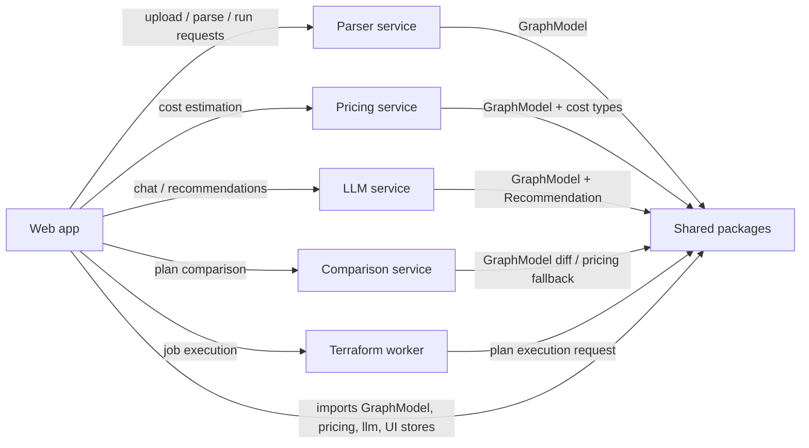

# Architecture Overview

## Opening Summary

This codebase is organized around a simple product idea: take a Terraform plan, turn it into a structured graph, enrich that graph with pricing and analysis, and then present it in a web UI for exploration, comparison, and guidance. The system is deliberately split into a browser-facing app, a set of backend services, and shared packages that define the common data model. The central contract is the graph model exported from [`packages/graph-schema/src/index.ts`](packages/graph-schema/src/index.ts#L25), which defines [`GraphNode`](packages/graph-schema/src/index.ts#L25), [`GraphEdge`](packages/graph-schema/src/index.ts#L37), and [`GraphModel`](packages/graph-schema/src/index.ts#L42). Almost every runtime path moves that model around.

At a high level, the web app accepts a plan upload or plan JSON, sends it to the parser, persists the resulting model locally, and then lets the user inspect costs, diff plans, and ask questions through the chat interface. The backend services each own one job: the parser converts Terraform JSON into graph data, the pricing service calculates estimated costs, the comparison service compares plans or falls back to rough estimates, and the LLM service generates recommendations based on the graph and a set of rules. The terraform worker is a separate execution environment for running plan-related work from a container or job process, with [`RunRequest`](apps/terraform-worker/src/main.ts#L17) as its request shape.

The important design theme is that the apps and services do not share UI or HTTP concerns. They exchange only stable data contracts such as `GraphModel`, pricing result types, and recommendation types. That keeps the parser, pricing engine, comparison logic, and LLM rules reusable across the web app, services, and worker processes.

## Major Runtime Flow

The flow starts in the web UI, especially the route handlers and pages such as [`POST`](apps/web/src/app/api/parse/route.ts#L5), [`POST`](apps/web/src/app/api/run/route.ts#L12), and the graph page [`GraphPage`](apps/web/src/app/graph/page.tsx#L32). Those entry points use the shared graph abstractions to move data between the frontend and services. The parser service entry point [`services/parser/src/main.ts`](services/parser/src/main.ts) wires HTTP routes into the parsing use case [`parsePlanUseCase`](services/parser/src/application/parse-plan.use-case.ts#L19), which ultimately calls the graph builder [`buildGraphModel`](services/parser/src/domain/plan-parser.ts#L79). The pricing side uses [`estimateCost`](packages/pricing-engine/src/estimator.ts#L6) and [`totalMonthlyCost`](packages/pricing-engine/src/estimator.ts#L18), while the LLM service generates output through [`buildPrompt`](services/llm/src/main.ts#L44) and [`runDeterministicRules`](services/llm/src/rules.ts#L155). Comparison is handled by [`estimateViaPricingService`](services/comparison/src/main.ts#L32) and [`roughMonthlyFallback`](services/comparison/src/main.ts#L28).

> **Sources:** `apps/web/src/app/api/parse/route.ts` · L5 · [`POST`](apps/web/src/app/api/parse/route.ts#L5); `apps/web/src/app/api/run/route.ts` · L12 · [`POST`](apps/web/src/app/api/run/route.ts#L12); `apps/web/src/app/graph/page.tsx` · L32 · [`GraphPage`](apps/web/src/app/graph/page.tsx#L32); `services/parser/src/application/parse-plan.use-case.ts` · L19 · [`parsePlanUseCase`](services/parser/src/application/parse-plan.use-case.ts#L19); `services/parser/src/domain/plan-parser.ts` · L79 · [`buildGraphModel`](services/parser/src/domain/plan-parser.ts#L79); `packages/pricing-engine/src/estimator.ts` · L6–L26 · [`estimateCost`](packages/pricing-engine/src/estimator.ts#L6)

## Component Responsibilities

| Component          | Responsibility                                                                                          | Key Entry Points                                                                                                                                                                                                                                                                                                                     | Shared Contracts                                                                                                                                                               |
| ------------------ | ------------------------------------------------------------------------------------------------------- | ------------------------------------------------------------------------------------------------------------------------------------------------------------------------------------------------------------------------------------------------------------------------------------------------------------------------------------ | ------------------------------------------------------------------------------------------------------------------------------------------------------------------------------ |
| Web app            | Orchestrates the user experience: upload, graph view, comparison, chat, settings, and local persistence | [`RootLayout`](apps/web/src/app/layout.tsx#L11), [`RootPage`](apps/web/src/app/page.tsx#L3), [`UploadPage`](apps/web/src/app/upload/page.tsx#L3), [`GraphPage`](apps/web/src/app/graph/page.tsx#L32)                                                                                                                                 | [`GraphModel`](packages/graph-schema/src/index.ts#L42), [`GraphNode`](packages/graph-schema/src/index.ts#L25)                                                                  |
| Parser service     | Converts Terraform plan JSON into graph data                                                            | [`services/parser/src/main.ts`](services/parser/src/main.ts), [`parsePlanUseCase`](services/parser/src/application/parse-plan.use-case.ts#L19), [`buildGraphModel`](services/parser/src/domain/plan-parser.ts#L79)                                                                                                                   | [`TerraformPlan`](services/parser/src/domain/terraform-plan.types.ts#L35), [`GraphModel`](packages/graph-schema/src/index.ts#L42)                                              |
| Pricing service    | Accepts graph nodes and returns cost estimates                                                          | [`services/pricing/src/main.ts`](services/pricing/src/main.ts), [`estimateNode`](services/pricing/src/main.ts#L20), [`estimateCost`](packages/pricing-engine/src/estimator.ts#L6)                                                                                                                                                    | [`PricingResult`](packages/pricing-types/src/index.ts#L26), [`CostEstimate`](packages/pricing-engine/src/types.ts#L1)                                                          |
| Comparison service | Compares plans and can fall back to rough pricing estimates                                             | [`services/comparison/src/main.ts`](services/comparison/src/main.ts), [`estimateViaPricingService`](services/comparison/src/main.ts#L32), [`roughMonthlyFallback`](services/comparison/src/main.ts#L28)                                                                                                                              | [`GraphModel`](packages/graph-schema/src/index.ts#L42), diff-related response shapes                                                                                           |
| LLM service        | Builds prompts, applies deterministic rules, and produces recommendations                               | [`services/llm/src/main.ts`](services/llm/src/main.ts), [`callLlm`](services/llm/src/main.ts#L28), [`buildPrompt`](services/llm/src/main.ts#L44), [`runDeterministicRules`](services/llm/src/rules.ts#L155)                                                                                                                          | [`Recommendation`](packages/llm-types/src/index.ts#L20), [`RecommendationResult`](packages/llm-types/src/index.ts#L31), [`GraphModel`](packages/graph-schema/src/index.ts#L42) |
| Terraform worker   | Runs Terraform-related execution in a worker process                                                    | [`RunRequest`](apps/terraform-worker/src/main.ts#L17)                                                                                                                                                                                                                                                                                | worker request/response payloads                                                                                                                                               |
| Shared packages    | Define the cross-cutting contracts used by every runtime actor                                          | [`packages/graph-schema/src/index.ts`](packages/graph-schema/src/index.ts#L25), [`packages/llm-types/src/index.ts`](packages/llm-types/src/index.ts#L20), [`packages/pricing-engine/src/estimator.ts`](packages/pricing-engine/src/estimator.ts#L6), [`packages/pricing-types/src/index.ts`](packages/pricing-types/src/index.ts#L9) | `GraphModel`, pricing types, recommendation types                                                                                                                              |

The most important observation is that the web app is mostly a coordinator and renderer, not the source of business logic. Actual parsing happens in the parser service, pricing logic in pricing packages and the pricing service, and recommendations in the LLM service. That boundary makes each part independently testable and deployable.

> **Sources:** `apps/web/src/app/layout.tsx` · L11 · [`RootLayout`](apps/web/src/app/layout.tsx#L11); `apps/web/src/app/page.tsx` · L3 · [`RootPage`](apps/web/src/app/page.tsx#L3); `apps/web/src/app/upload/page.tsx` · L3 · [`UploadPage`](apps/web/src/app/upload/page.tsx#L3); `services/pricing/src/main.ts` · L20 · [`estimateNode`](services/pricing/src/main.ts#L20); `services/llm/src/main.ts` · L23–L44 · [`buildClient`](services/llm/src/main.ts#L23); `apps/terraform-worker/src/main.ts` · L17 · [`RunRequest`](apps/terraform-worker/src/main.ts#L17)

## Design Decisions and Boundaries

### Apps vs. Services vs. Shared Packages

The repository shows a clear separation of concerns:

- **Apps** own user-facing entry points and local state management. The web app includes routes like [`POST`](apps/web/src/app/api/chat/route.ts#L9), [`POST`](apps/web/src/app/api/parse/route.ts#L5), and [`POST`](apps/web/src/app/api/run/route.ts#L12), plus pages like [`GraphPage`](apps/web/src/app/graph/page.tsx#L32) and [`UploadPage`](apps/web/src/app/upload/page.tsx#L3). It also contains local persistence helpers such as [`savePlan`](apps/web/src/lib/plan-store.ts#L39), [`saveBaseline`](apps/web/src/lib/baseline-store.ts#L12), and [`encodePlan`](apps/web/src/lib/plan-url.ts#L64).
- **Services** own domain logic and API surfaces. For example, the parser service assembles a graph from Terraform inputs via [`flattenResources`](services/parser/src/domain/plan-parser.ts#L11), [`buildEdges`](services/parser/src/domain/plan-parser.ts#L62), and [`buildGraphModel`](services/parser/src/domain/plan-parser.ts#L79). The LLM service focuses on prompt assembly and rule execution via [`checkNoDatabase`](services/llm/src/rules.ts#L11) and [`buildPrompt`](services/llm/src/main.ts#L44). The pricing service is a thin HTTP layer around the pricing engine.
- **Shared packages** define stable, reusable abstractions. [`GraphNode`](packages/graph-schema/src/index.ts#L25), [`GraphEdge`](packages/graph-schema/src/index.ts#L37), and [`GraphModel`](packages/graph-schema/src/index.ts#L42) are the main examples. Pricing-related shared contracts include [`ResourceEstimate`](packages/pricing-types/src/index.ts#L9), [`CostLineItem`](packages/pricing-types/src/index.ts#L19), and [`PricingResult`](packages/pricing-types/src/index.ts#L26). Recommendation contracts live in [`packages/llm-types/src/index.ts`](packages/llm-types/src/index.ts#L20).

### Why the Graph Model Is the Boundary

The `GraphModel` is the system’s lingua franca. The parser emits it, the web app stores and renders it, the pricing engine consumes it, and the LLM service uses it as the basis for recommendations. That reduces coupling between implementations and makes it possible to swap underlying services without rewriting the client side.

### Local-First UI State

The web app deliberately keeps a lot of state in browser storage and client-side stores. The graph page imports local persistence helpers from [`apps/web/src/lib/plan-store.ts`](apps/web/src/lib/plan-store.ts#L1), [`apps/web/src/lib/baseline-store.ts`](apps/web/src/lib/baseline-store.ts#L5), and [`apps/web/src/lib/usage-utils.ts`](apps/web/src/lib/usage-utils.ts#L1), plus stores such as [`useUIStore`](apps/web/src/stores/useUIStore.ts#L7) and [`useUsageStore`](apps/web/src/stores/useUsageStore.ts#L5). This suggests a UX optimized for rapid graph exploration and offline-ish interactions, with server services used for compute-heavy or structured work.

### Shared Abstraction Table

| Shared Abstraction                                         | Purpose                                            | Used By                                                                  |
| ---------------------------------------------------------- | -------------------------------------------------- | ------------------------------------------------------------------------ |
| [`GraphModel`](packages/graph-schema/src/index.ts#L42)     | Canonical graph representation of a Terraform plan | web app, parser service, pricing engine, comparison service, LLM service |
| [`GraphNode`](packages/graph-schema/src/index.ts#L25)      | Represents a single resource/node in the graph     | `TwoDGraph`, `NodeDetail`, pricing, comparison, LLM rules                |
| [`GraphEdge`](packages/graph-schema/src/index.ts#L37)      | Represents graph relationships                     | graph rendering and comparison flows                                     |
| [`Recommendation`](packages/llm-types/src/index.ts#L20)    | Rule or model output used by LLM service           | LLM prompt generation and response types                                 |
| [`PricingResult`](packages/pricing-types/src/index.ts#L26) | Structured pricing output                          | pricing service and UI cost displays                                     |
| [`RunRequest`](apps/terraform-worker/src/main.ts#L17)      | Worker execution request shape                     | terraform worker runtime                                                 |

This architecture keeps the edges between layers explicit: UI code depends on shared contracts and service APIs, but service code does not depend on UI components. That is a strong boundary for long-term maintainability.

> **Sources:** `apps/web/src/lib/plan-store.ts` · L1–L99 · [`savePlan`](apps/web/src/lib/plan-store.ts#L39); `apps/web/src/lib/baseline-store.ts` · L5–L31 · [`saveBaseline`](apps/web/src/lib/baseline-store.ts#L12); `apps/web/src/lib/usage-utils.ts` · L1–L22 · [`applyUsageOverrides`](apps/web/src/lib/usage-utils.ts#L22); `apps/web/src/stores/useUIStore.ts` · L7 · [`useUIStore`](apps/web/src/stores/useUIStore.ts#L7); `packages/graph-schema/src/index.ts` · L25–L42 · [`GraphNode`](packages/graph-schema/src/index.ts#L25); `packages/pricing-types/src/index.ts` · L9–L26 · [`PricingResult`](packages/pricing-types/src/index.ts#L26); `packages/llm-types/src/index.ts` · L20–L31 · [`Recommendation`](packages/llm-types/src/index.ts#L20)

## Runtime Entry Points Worth Knowing

The most important entry points are the ones that define runtime boundaries:

- Web app request handlers: [`POST`](apps/web/src/app/api/parse/route.ts#L5), [`POST`](apps/web/src/app/api/run/route.ts#L12), [`POST`](apps/web/src/app/api/chat/route.ts#L9), and [`GET`](apps/web/src/app/api/health/route.ts#L3)
- App shell and navigation: [`RootLayout`](apps/web/src/app/layout.tsx#L11), [`ClientShell`](apps/web/src/components/layout/ClientShell.tsx#L14), [`Sidebar`](apps/web/src/components/layout/Sidebar.tsx#L107)
- Core graph view: [`GraphPage`](apps/web/src/app/graph/page.tsx#L32)
- Service process roots: [`services/parser/src/main.ts`](services/parser/src/main.ts), [`services/pricing/src/main.ts`](services/pricing/src/main.ts), [`services/llm/src/main.ts`](services/llm/src/main.ts), [`services/comparison/src/main.ts`](services/comparison/src/main.ts), and [`apps/terraform-worker/src/main.ts`](apps/terraform-worker/src/main.ts)

These are the places to start when tracing how a request enters the system and which subsystem owns the work.

> **Sources:** `apps/web/src/app/api/chat/route.ts` · L3–L9 · [`POST`](apps/web/src/app/api/chat/route.ts#L9); `apps/web/src/app/api/health/route.ts` · L3 · [`GET`](apps/web/src/app/api/health/route.ts#L3); `services/parser/src/main.ts`; `services/pricing/src/main.ts`; `services/llm/src/main.ts`; `services/comparison/src/main.ts`; `apps/terraform-worker/src/main.ts`
