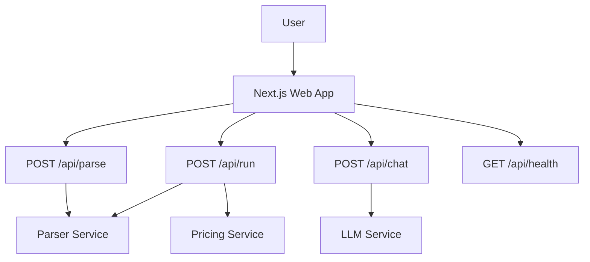

# CLI Reference

This repository does not expose a conventional end-user command-line interface surface. The observable entry points are primarily web application routes and service modules, such as the Next.js API handlers [`POST`](apps/web/src/app/api/chat/route.ts#L9), [`GET`](apps/web/src/app/api/health/route.ts#L3), [`POST`](apps/web/src/app/api/parse/route.ts#L5), and [`POST`](apps/web/src/app/api/run/route.ts#L12), plus service entry modules like [`services/parser/src/main.ts`](services/parser/src/main.ts) and [`services/pricing/src/main.ts`](services/pricing/src/main.ts). As a result, this page is intentionally minimal and focuses on the user-facing HTTP/API surface rather than internal helpers or CI-only tooling.

## What users can actually invoke

The repo’s primary interactions are web- or service-driven:

- The web app exposes application pages such as [`RootPage`](apps/web/src/app/page.tsx#L3), [`UploadPage`](apps/web/src/app/upload/page.tsx#L3), and [`GraphPage`](apps/web/src/app/graph/page.tsx#L32).
- The application backend exposes API routes for health, parsing, running plans, and chat. These are the closest thing to a stable “command surface” for users.
- Service modules such as [`parsePlanUseCase`](services/parser/src/application/parse-plan.use-case.ts#L19), [`buildGraphModel`](services/parser/src/domain/plan-parser.ts#L79), and [`estimateCost`](packages/pricing-engine/src/estimator.ts#L6) are internal implementation details, not user-facing CLI commands.

Because the repository does not surface a standalone executable with documented subcommands, there is no meaningful `terraform-worker`-style CLI reference to list here. The `apps/terraform-worker/src/main.ts` file defines a [`RunRequest`](apps/terraform-worker/src/main.ts#L17) shape, but the analysis data does not show a user-facing command wrapper around it.

## User-facing API entry points

| Command / Endpoint | Purpose                                                  | Arguments / Payload                                                                                                                                                         | Example                                                                                                                  |
| ------------------ | -------------------------------------------------------- | --------------------------------------------------------------------------------------------------------------------------------------------------------------------------- | ------------------------------------------------------------------------------------------------------------------------ |
| `GET /api/health`  | Health check for the web service                         | None                                                                                                                                                                        | `curl http://localhost:3000/api/health`                                                                                  |
| `POST /api/parse`  | Parse a Terraform plan into the repository’s graph model | Request body accepted by [`POST`](apps/web/src/app/api/parse/route.ts#L5); internals reference `GraphModel` via [`_GraphModelRef`](apps/web/src/app/api/parse/route.ts#L14) | `curl -X POST http://localhost:3000/api/parse -H 'Content-Type: application/json' -d @plan.json`                         |
| `POST /api/run`    | Run plan-related processing through the web backend      | Request body defined by [`RunRequestBody`](apps/web/src/app/api/run/route.ts#L5); handler is [`POST`](apps/web/src/app/api/run/route.ts#L12)                                | `curl -X POST http://localhost:3000/api/run -H 'Content-Type: application/json' -d '{"archiveBase64":"..."}'`            |
| `POST /api/chat`   | Chat/LLM interaction endpoint for the UI                 | Request shape defined by [`RequestBody`](apps/web/src/app/api/chat/route.ts#L3); handler is [`POST`](apps/web/src/app/api/chat/route.ts#L9)                                 | `curl -X POST http://localhost:3000/api/chat -H 'Content-Type: application/json' -d '{"message":"Summarize this plan"}'` |

The table above reflects the actual externally visible operations discovered in the analysis data. It intentionally omits helper-only functions such as [`fetchWithTimeout`](apps/web/src/lib/server-api.ts#L3), [`runPlan`](apps/web/src/lib/server-api.ts#L56), and [`parsePlan`](apps/web/src/lib/server-api.ts#L26), since those are support utilities used by the application rather than commands that users invoke directly.

## How the backend is structured

The UI and API layers are designed around a browser-first workflow:

In practical terms, users interact with the web UI, which then calls API endpoints that delegate to dedicated services. For example, parsing flows through parser logic such as [`parsePlanUseCase`](services/parser/src/application/parse-plan.use-case.ts#L19) and graph construction via [`buildGraphModel`](services/parser/src/domain/plan-parser.ts#L79). Likewise, pricing is handled by functions like [`estimateCost`](packages/pricing-engine/src/estimator.ts#L6), [`totalMonthlyCost`](packages/pricing-engine/src/estimator.ts#L18), and [`costByProvider`](packages/pricing-engine/src/estimator.ts#L26).

## Environment assumptions

The observable code strongly suggests the following runtime assumptions:

- A browser-hosted web app is the primary user interface, backed by a Next.js application layout such as [`RootLayout`](apps/web/src/app/layout.tsx#L11).
- API endpoints are expected to be reachable from that app at the same origin or an environment-configured backend base URL.
- Local client-side persistence is used for features like plan history, baselines, theme selection, and usage overrides via modules such as [`savePlan`](apps/web/src/lib/plan-store.ts#L39), [`saveBaseline`](apps/web/src/lib/baseline-store.ts#L12), and [`getStoredTheme`](apps/web/src/lib/theme-store.ts#L4).
- Some features may run differently in Tauri versus browser mode, as indicated by [`isTauri`](apps/web/src/lib/tauri-bridge.ts#L11) and [`openPlanFile`](apps/web/src/lib/tauri-bridge.ts#L40), but this is still an application runtime concern rather than a CLI interface.

If you are looking for a shell command reference, the repository does not currently expose one in the analysis data. The user-facing entry surface is web/API-centric, not CLI-centric.

> **Sources:** `apps/web/src/app/api/health/route.ts` · L3–L3 · [`GET`](apps/web/src/app/api/health/route.ts#L3)  
> **Sources:** `apps/web/src/app/api/parse/route.ts` · L5–L14 · [`POST`](apps/web/src/app/api/parse/route.ts#L5) · [`_GraphModelRef`](apps/web/src/app/api/parse/route.ts#L14)  
> **Sources:** `apps/web/src/app/api/run/route.ts` · L5–L12 · [`RunRequestBody`](apps/web/src/app/api/run/route.ts#L5) · [`POST`](apps/web/src/app/api/run/route.ts#L12)  
> **Sources:** `apps/web/src/app/api/chat/route.ts` · L3–L9 · [`RequestBody`](apps/web/src/app/api/chat/route.ts#L3) · [`POST`](apps/web/src/app/api/chat/route.ts#L9)  
> **Sources:** `services/parser/src/application/parse-plan.use-case.ts` · L19–L19 · [`parsePlanUseCase`](services/parser/src/application/parse-plan.use-case.ts#L19)  
> **Sources:** `services/parser/src/domain/plan-parser.ts` · L79–L79 · [`buildGraphModel`](services/parser/src/domain/plan-parser.ts#L79)  
> **Sources:** `packages/pricing-engine/src/estimator.ts` · L6–L26 · [`estimateCost`](packages/pricing-engine/src/estimator.ts#L6) · [`totalMonthlyCost`](packages/pricing-engine/src/estimator.ts#L18) · [`costByProvider`](packages/pricing-engine/src/estimator.ts#L26)  
> **Sources:** `apps/web/src/lib/plan-store.ts` · L39–L99 · [`savePlan`](apps/web/src/lib/plan-store.ts#L39) · [`saveToHistory`](apps/web/src/lib/plan-store.ts#L70)  
> **Sources:** `apps/web/src/lib/baseline-store.ts` · L12–L31 · [`saveBaseline`](apps/web/src/lib/baseline-store.ts#L12) · [`loadBaseline`](apps/web/src/lib/baseline-store.ts#L22) · [`clearBaseline`](apps/web/src/lib/baseline-store.ts#L31)  
> **Sources:** `apps/web/src/lib/theme-store.ts` · L4–L14 · [`getStoredTheme`](apps/web/src/lib/theme-store.ts#L4) · [`applyTheme`](apps/web/src/lib/theme-store.ts#L9) · [`toggleTheme`](apps/web/src/lib/theme-store.ts#L14)
