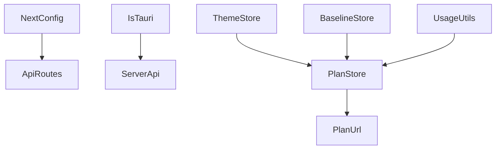

# Repository Configuration Surfaces

This page documents the repository’s configuration surfaces: source files that define runtime configuration, environment-driven settings, and persistent client-side preferences. Scope is intentionally limited to configuration and override behavior; it does not cover product/business logic or UI flow.

## Configuration at a Glance

The repository uses a mix of configuration mechanisms depending on runtime:

- **Next.js app configuration** in [`apps/web/next.config.ts`](apps/web/next.config.ts) for the web app build/runtime.
- **Service process configuration** in the service entry points such as [`services/parser/src/main.ts`](services/parser/src/main.ts), [`services/llm/src/main.ts`](services/llm/src/main.ts), [`services/comparison/src/main.ts`](services/comparison/src/main.ts), and [`services/pricing/src/main.ts`](services/pricing/src/main.ts).
- **Shared package defaults and types** in packages like [`packages/pricing-engine/src/index.ts`](packages/pricing-engine/src/index.ts), [`packages/pricing-engine/src/types.ts`](packages/pricing-engine/src/types.ts), [`packages/pricing-types/src/index.ts`](packages/pricing-types/src/index.ts), [`packages/graph-schema/src/index.ts`](packages/graph-schema/src/index.ts), and [`packages/llm-types/src/index.ts`](packages/llm-types/src/index.ts), which define the schema-level “configuration contracts” used across the monorepo.
- **Client-side persistent settings** in the web app through local/session storage helpers such as [`apps/web/src/lib/theme-store.ts`](apps/web/src/lib/theme-store.ts), [`apps/web/src/lib/plan-store.ts`](apps/web/src/lib/plan-store.ts), [`apps/web/src/lib/baseline-store.ts`](apps/web/src/lib/baseline-store.ts), [`apps/web/src/lib/usage-utils.ts`](apps/web/src/lib/usage-utils.ts), and [`apps/web/src/lib/plan-url.ts`](apps/web/src/lib/plan-url.ts).
- **Bridge/runtime selection logic** in [`apps/web/src/lib/server-api.ts`](apps/web/src/lib/server-api.ts) and [`apps/web/src/lib/tauri-bridge.ts`](apps/web/src/lib/tauri-bridge.ts), which determine whether the web app talks to hosted services or a local Tauri runtime.

The strongest theme is **layered precedence**: compile-time/build config and environment variables establish defaults, while browser storage, URL state, and user edits override those defaults at runtime.

> **Sources:** `apps/web/next.config.ts` · `services/parser/src/main.ts` · `services/llm/src/main.ts` · `services/comparison/src/main.ts` · `services/pricing/src/main.ts` · `apps/web/src/lib/theme-store.ts` · `apps/web/src/lib/plan-store.ts` · `apps/web/src/lib/baseline-store.ts` · `apps/web/src/lib/usage-utils.ts` · `apps/web/src/lib/plan-url.ts` · `apps/web/src/lib/server-api.ts` · `apps/web/src/lib/tauri-bridge.ts`

## Repository Configuration Surfaces Table

| Config file / surface                                                          | Purpose                                                                 | Runtime affected                         |
| ------------------------------------------------------------------------------ | ----------------------------------------------------------------------- | ---------------------------------------- |
| [`apps/web/next.config.ts`](apps/web/next.config.ts)                           | Next.js build/runtime configuration for the web app                     | Web app build and server/client bundling |
| [`services/parser/src/main.ts`](services/parser/src/main.ts)                   | Service bootstrap and server-level configuration for parsing API        | Parser service                           |
| [`services/llm/src/main.ts`](services/llm/src/main.ts)                         | Service bootstrap and model/client configuration                        | LLM service                              |
| [`services/comparison/src/main.ts`](services/comparison/src/main.ts)           | Comparison service bootstrap and outbound request configuration         | Comparison service                       |
| [`services/pricing/src/main.ts`](services/pricing/src/main.ts)                 | Pricing service bootstrap and input loading                             | Pricing service                          |
| [`apps/terraform-worker/src/main.ts`](apps/terraform-worker/src/main.ts)       | Worker runtime configuration and request schema for Terraform execution | Terraform worker                         |
| [`apps/web/src/lib/server-api.ts`](apps/web/src/lib/server-api.ts)             | Client/server API endpoint selection and request dispatch               | Web app data access layer                |
| [`apps/web/src/lib/tauri-bridge.ts`](apps/web/src/lib/tauri-bridge.ts)         | Runtime detection for local Tauri integration                           | Web app desktop runtime                  |
| [`apps/web/src/lib/theme-store.ts`](apps/web/src/lib/theme-store.ts)           | Theme persistence and initial theme selection                           | Web app UI state                         |
| [`apps/web/src/lib/plan-store.ts`](apps/web/src/lib/plan-store.ts)             | Plan persistence, history, and storage quota handling                   | Web app local state                      |
| [`apps/web/src/lib/baseline-store.ts`](apps/web/src/lib/baseline-store.ts)     | Baseline plan persistence                                               | Web app local state                      |
| [`apps/web/src/lib/usage-utils.ts`](apps/web/src/lib/usage-utils.ts)           | Usage override persistence and application                              | Web app pricing inputs                   |
| [`apps/web/src/lib/plan-url.ts`](apps/web/src/lib/plan-url.ts)                 | Encode/decode of plan payloads in URLs                                  | Web app shareable state                  |
| [`packages/graph-schema/src/index.ts`](packages/graph-schema/src/index.ts)     | Shared graph model/types used by services and app                       | All graph-producing/consuming code       |
| [`packages/llm-types/src/index.ts`](packages/llm-types/src/index.ts)           | Shared LLM request/response types                                       | LLM service and web app contract         |
| [`packages/pricing-engine/src/index.ts`](packages/pricing-engine/src/index.ts) | Pricing engine public API and defaults                                  | Pricing service and web pricing flow     |
| [`packages/pricing-engine/src/types.ts`](packages/pricing-engine/src/types.ts) | Pricing engine override/config types                                    | Pricing calculation inputs               |
| [`packages/pricing-types/src/index.ts`](packages/pricing-types/src/index.ts)   | Shared pricing result types                                             | Pricing service / web app boundary       |
| [`vitest.config.ts`](vitest.config.ts)                                         | Test runner configuration                                               | Repository tests                         |

> **Sources:** `apps/web/next.config.ts` · `apps/terraform-worker/src/main.ts` · `services/parser/src/main.ts` · `services/llm/src/main.ts` · `services/comparison/src/main.ts` · `services/pricing/src/main.ts` · `apps/web/src/lib/server-api.ts` · `apps/web/src/lib/tauri-bridge.ts` · `apps/web/src/lib/theme-store.ts` · `apps/web/src/lib/plan-store.ts` · `apps/web/src/lib/baseline-store.ts` · `apps/web/src/lib/usage-utils.ts` · `apps/web/src/lib/plan-url.ts` · `packages/graph-schema/src/index.ts` · `packages/llm-types/src/index.ts` · `packages/pricing-engine/src/index.ts` · `packages/pricing-engine/src/types.ts` · `packages/pricing-types/src/index.ts` · `vitest.config.ts`

## Environment Variables and Settings

The static analysis data does not expose a central env registry file, so this table is limited to settings that are observable in the source tree or implied by runtime bootstrap code. Some service entry points likely read environment variables internally, but without symbol-level evidence here, only clearly visible configuration surfaces are listed.

| Environment variable / setting        | Observed use                                                                                                                                                                                                                                                                                                                                          | Runtime affected              | Default / override notes                                                                                      |
| ------------------------------------- | ----------------------------------------------------------------------------------------------------------------------------------------------------------------------------------------------------------------------------------------------------------------------------------------------------------------------------------------------------- | ----------------------------- | ------------------------------------------------------------------------------------------------------------- |
| `process.env`-driven service settings | Used by service entry points and client construction in [`services/llm/src/main.ts`](services/llm/src/main.ts), [`services/comparison/src/main.ts`](services/comparison/src/main.ts), [`services/parser/src/main.ts`](services/parser/src/main.ts), and [`services/pricing/src/main.ts`](services/pricing/src/main.ts)                                | Backend services              | Defaults are service-specific; environment values override code defaults where implemented in the entry point |
| Tauri runtime detection               | [`isTauri`](apps/web/src/lib/tauri-bridge.ts#L11) determines whether desktop-native integration is active                                                                                                                                                                                                                                             | Web app desktop build/runtime | No env var is shown in the analysis data; detection is runtime-based rather than config-file-based            |
| Theme preference key                  | [`getStoredTheme`](apps/web/src/lib/theme-store.ts#L4), [`applyTheme`](apps/web/src/lib/theme-store.ts#L9), and [`toggleTheme`](apps/web/src/lib/theme-store.ts#L14) persist the active theme in browser storage                                                                                                                                      | Web app                       | Stored preference overrides the initial/default theme choice                                                  |
| Plan storage keys                     | [`savePlan`](apps/web/src/lib/plan-store.ts#L39), [`loadPlan`](apps/web/src/lib/plan-store.ts#L54), [`saveToHistory`](apps/web/src/lib/plan-store.ts#L70), [`loadHistory`](apps/web/src/lib/plan-store.ts#L93) persist plan data/history                                                                                                              | Web app                       | Stored plan data overrides empty/default in-memory state                                                      |
| Baseline storage key                  | [`saveBaseline`](apps/web/src/lib/baseline-store.ts#L12), [`loadBaseline`](apps/web/src/lib/baseline-store.ts#L22), [`clearBaseline`](apps/web/src/lib/baseline-store.ts#L31) manage baseline plan state                                                                                                                                              | Web app                       | Baseline in storage overrides “no baseline selected” default                                                  |
| Usage override storage                | [`loadUsageOverrides`](apps/web/src/lib/usage-utils.ts#L2), [`saveUsageOverride`](apps/web/src/lib/usage-utils.ts#L9), [`resetUsageOverride`](apps/web/src/lib/usage-utils.ts#L15), [`resetAllUsageOverrides`](apps/web/src/lib/usage-utils.ts#L20), [`applyUsageOverrides`](apps/web/src/lib/usage-utils.ts#L22) manage overrides for pricing inputs | Web app                       | Explicit user override takes precedence over package defaults                                                 |

> **Sources:** `services/llm/src/main.ts` · `services/comparison/src/main.ts` · `services/parser/src/main.ts` · `services/pricing/src/main.ts` · `apps/web/src/lib/tauri-bridge.ts` · `apps/web/src/lib/theme-store.ts` · `apps/web/src/lib/plan-store.ts` · `apps/web/src/lib/baseline-store.ts` · `apps/web/src/lib/usage-utils.ts`

## How the Web App Reads Configuration

The web app combines build-time configuration, runtime detection, and persisted user settings.

### Build-time and route configuration

The Next.js app entrypoints are defined under `apps/web/src/app`, while the build/runtime setup comes from [`apps/web/next.config.ts`](apps/web/next.config.ts). The route handlers in [`apps/web/src/app/api/run/route.ts`](apps/web/src/app/api/run/route.ts), [`apps/web/src/app/api/parse/route.ts`](apps/web/src/app/api/parse/route.ts), [`apps/web/src/app/api/chat/route.ts`](apps/web/src/app/api/chat/route.ts), and [`apps/web/src/app/api/health/route.ts`](apps/web/src/app/api/health/route.ts) are the server-side API surfaces the front end uses, but they are not themselves “config files”; they are configuration consumers.

The web app’s runtime behavior is shaped by whether it runs in the browser or in a Tauri shell. [`isTauri`](apps/web/src/lib/tauri-bridge.ts#L11) is the key selector, and functions such as [`parsePlan`](apps/web/src/lib/tauri-bridge.ts#L20), [`openPlanFile`](apps/web/src/lib/tauri-bridge.ts#L40), and [`estimateCosts`](apps/web/src/lib/tauri-bridge.ts#L54) route to local desktop capabilities when available.

### Client-side persistence as configuration

Several shared helpers provide persistent, user-editable configuration:

- [`getStoredTheme`](apps/web/src/lib/theme-store.ts#L4) reads the active theme from storage.
- [`applyTheme`](apps/web/src/lib/theme-store.ts#L9) applies the selected theme.
- [`loadPlan`](apps/web/src/lib/plan-store.ts#L54) and [`loadHistory`](apps/web/src/lib/plan-store.ts#L93) restore plans and plan history.
- [`loadBaseline`](apps/web/src/lib/baseline-store.ts#L22) restores the baseline comparison target.
- [`loadUsageOverrides`](apps/web/src/lib/usage-utils.ts#L2) restores user-adjusted usage assumptions.
- [`decodePlan`](apps/web/src/lib/plan-url.ts#L66) restores shareable plan state from a URL payload.

The precedence is consistent: browser storage and URL payloads override the blank or default state used on first load.

> **Sources:** `apps/web/next.config.ts` · `apps/web/src/lib/tauri-bridge.ts` · `apps/web/src/lib/server-api.ts` · `apps/web/src/lib/theme-store.ts` · `apps/web/src/lib/plan-store.ts` · `apps/web/src/lib/baseline-store.ts` · `apps/web/src/lib/usage-utils.ts` · `apps/web/src/lib/plan-url.ts`

## How Services Read Configuration

The service layer is organized as separate runtime entry points, each with its own bootstrap logic:

- [`services/parser/src/main.ts`](services/parser/src/main.ts) starts the parser service and exposes HTTP routes from [`services/parser/src/infrastructure/http/parser.routes.ts`](services/parser/src/infrastructure/http/parser.routes.ts).
- [`services/llm/src/main.ts`](services/llm/src/main.ts) constructs an LLM client with [`buildClient`](services/llm/src/main.ts#L23) and drives requests through [`callLlm`](services/llm/src/main.ts#L28) and [`buildPrompt`](services/llm/src/main.ts#L44).
- [`services/comparison/src/main.ts`](services/comparison/src/main.ts) performs outbound fetches through [`fetchWithTimeout`](services/comparison/src/main.ts#L8) and can fall back to [`roughMonthlyFallback`](services/comparison/src/main.ts#L28) if the pricing service cannot be reached.
- [`services/pricing/src/main.ts`](services/pricing/src/main.ts) uses [`estimateNode`](services/pricing/src/main.ts#L20) to perform pricing calculations.
- [`apps/terraform-worker/src/main.ts`](apps/terraform-worker/src/main.ts) validates worker requests using [`RunRequest`](apps/terraform-worker/src/main.ts#L17).

Although the analysis data does not reveal every env key or constant in those entry points, the presence of dedicated `main.ts` files shows that configuration is not centralized; each service owns its own bootstrap-time settings.

### Shared package configuration contracts

The packages under `packages/` provide the type-level configuration contracts that the services and web app rely on:

- [`GraphModel`](packages/graph-schema/src/index.ts#L42), [`GraphNode`](packages/graph-schema/src/index.ts#L25), and [`GraphEdge`](packages/graph-schema/src/index.ts#L37) define the canonical graph shape.
- [`Recommendation`](packages/llm-types/src/index.ts#L20) and [`RecommendationResult`](packages/llm-types/src/index.ts#L31) define the response contract for LLM outputs.
- [`CostEstimate`](packages/pricing-engine/src/types.ts#L1), [`BreakdownItem`](packages/pricing-engine/src/types.ts#L12), and [`UsageOverrides`](packages/pricing-engine/src/types.ts#L20) define pricing input/output shape and override semantics.
- [`ResourceEstimate`](packages/pricing-types/src/index.ts#L9), [`CostLineItem`](packages/pricing-types/src/index.ts#L19), and [`PricingResult`](packages/pricing-types/src/index.ts#L26) define the stable pricing-service API payloads.

These packages act as shared configuration schemas. They do not read environment variables directly in the evidence provided, but they define the structures that environment-backed configuration must satisfy at runtime.

> **Sources:** `apps/terraform-worker/src/main.ts` · `services/parser/src/main.ts` · `services/parser/src/infrastructure/http/parser.routes.ts` · `services/llm/src/main.ts` · `services/comparison/src/main.ts` · `services/pricing/src/main.ts` · `packages/graph-schema/src/index.ts` · `packages/llm-types/src/index.ts` · `packages/pricing-engine/src/types.ts` · `packages/pricing-types/src/index.ts`

## Defaults and Override Precedence

The repository generally follows a “lowest to highest precedence” model:

1. **Package-defined defaults and type contracts**  
   Shared package types define the baseline shape for all config-like inputs, for example [`UsageOverrides`](packages/pricing-engine/src/types.ts#L20) and [`PricingResult`](packages/pricing-types/src/index.ts#L26).

2. **Service bootstrap defaults**  
   Each service entry point (`main.ts`) can establish defaults for ports, clients, endpoints, or timeouts. The evidence shows this pattern through dedicated constructors like [`buildClient`](services/llm/src/main.ts#L23) and [`fetchWithTimeout`](services/comparison/src/main.ts#L8), even though the exact env keys are not exposed in the analysis payload.

3. **Persistent user settings**  
   The web app stores user preferences in browser storage: theme, plan, baseline, and usage overrides.

4. **URL-encoded state**  
   [`encodePlan`](apps/web/src/lib/plan-url.ts#L64) and [`decodePlan`](apps/web/src/lib/plan-url.ts#L66) provide a shareable, link-based override layer that can supersede an otherwise empty state.

5. **Explicit runtime overrides**  
   Functions like [`saveUsageOverride`](apps/web/src/lib/usage-utils.ts#L9), [`resetUsageOverride`](apps/web/src/lib/usage-utils.ts#L15), and [`clearBaseline`](apps/web/src/lib/baseline-store.ts#L31) let the user intentionally replace prior stored values.

This means the effective configuration is often assembled from several sources. For example, a pricing-related view may start with package defaults, apply user-specific usage overrides from storage, and then accept per-session changes from the current URL or editor state.

> **Sources:** `packages/pricing-engine/src/types.ts` · `packages/pricing-types/src/index.ts` · `services/llm/src/main.ts` · `services/comparison/src/main.ts` · `apps/web/src/lib/theme-store.ts` · `apps/web/src/lib/plan-store.ts` · `apps/web/src/lib/baseline-store.ts` · `apps/web/src/lib/usage-utils.ts` · `apps/web/src/lib/plan-url.ts`

## Configuration Coupling Across Modules

The repository’s configuration surfaces are moderately coupled through shared contracts rather than shared global state.

| Module             | Imports From                                                             | Called By                            | Calls Into                                                          | Inherits From |
| ------------------ | ------------------------------------------------------------------------ | ------------------------------------ | ------------------------------------------------------------------- | ------------- |
| Web app            | `packages/graph-schema`, `packages/pricing-types`, local storage helpers | `next` runtime, browser session      | `apps/web/src/lib/*`, `apps/web/src/components/*`, API routes       | N/A           |
| Parser service     | `packages/graph-schema`                                                  | HTTP requests, parser entry point    | `services/parser/src/application/*`, `services/parser/src/domain/*` | N/A           |
| LLM service        | `packages/graph-schema`                                                  | HTTP requests, LLM entry point       | `services/llm/src/rules.ts`                                         | N/A           |
| Comparison service | `packages/graph-schema`, `packages/pricing-engine`                       | API requests, comparison entry point | pricing engine and outbound fetch helpers                           | N/A           |
| Pricing service    | `packages/graph-schema`, `packages/pricing-engine`                       | API requests, pricing entry point    | `packages/pricing-engine/src/index.ts`                              | N/A           |
| Terraform worker   | `zod`, Node built-ins                                                    | worker runtime                       | worker-specific execution code                                      | N/A           |

> **Sources:** `apps/web/src/lib/server-api.ts` · `apps/web/src/lib/tauri-bridge.ts` · `services/parser/src/main.ts` · `services/llm/src/main.ts` · `services/comparison/src/main.ts` · `services/pricing/src/main.ts` · `apps/terraform-worker/src/main.ts` · `packages/graph-schema/src/index.ts` · `packages/pricing-engine/src/index.ts` · `packages/pricing-types/src/index.ts`

## What Is Not Evident in the Analysis

A few likely configuration details are not directly observable from the provided symbol index:

- The exact names of environment variables used by each `main.ts`.
- The full `next.config.ts` option set.
- The precise storage keys used by the browser persistence helpers.
- Any `.env` or `.env.example` files, if present in the repository, were not included in `files_seen`.

Where those specifics matter operationally, the source files above are the correct starting points, but this page only documents what can be confirmed from the available analysis.

> **Sources:** `apps/web/next.config.ts` · `apps/web/src/lib/theme-store.ts` · `apps/web/src/lib/plan-store.ts` · `apps/web/src/lib/baseline-store.ts` · `apps/web/src/lib/usage-utils.ts` · `services/parser/src/main.ts` · `services/llm/src/main.ts` · `services/comparison/src/main.ts` · `services/pricing/src/main.ts`
