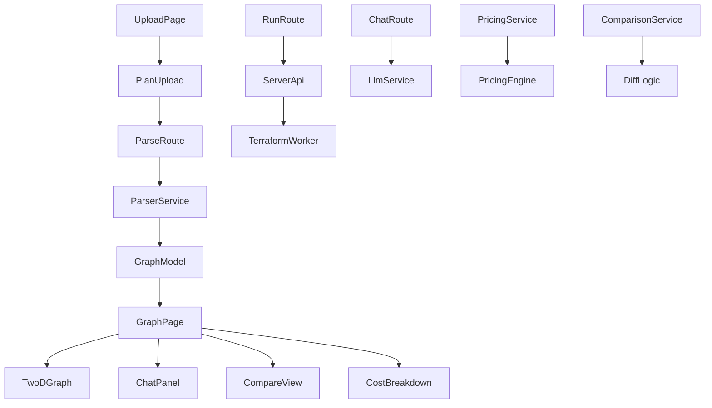

# Terraform Insight Platform

Terraform Insight Platform is a multi-service developer tool for turning Terraform plan output into something easier to understand, compare, and act on. It combines plan parsing, graph visualization, LLM-assisted analysis, pricing estimation, and comparison workflows in a single web experience, with supporting backend services for parsing, LLM rules, pricing, and diffing.

At a high level, the web app in [`apps/web`](apps/web/src/app/page.tsx) lets you upload or load a plan, view its graph, inspect resource details, chat with an LLM about the plan, and compare changes over time. The backend services in [`services/parser`](services/parser/src/main.ts), [`services/llm`](services/llm/src/main.ts), [`services/pricing`](services/pricing/src/main.ts), and [`services/comparison`](services/comparison/src/main.ts) provide the core processing pipeline.

## Main Use Cases

### Terraform Plan Parsing

The parser service transforms Terraform plan data into a structured graph model. The main domain flow starts from [`parsePlanUseCase`](services/parser/src/application/parse-plan.use-case.ts#L19) and builds a graph via [`buildGraphModel`](services/parser/src/domain/plan-parser.ts#L79). The output model is represented by [`GraphModel`](packages/graph-schema/src/index.ts#L42), with nodes and edges defined in [`GraphNode`](packages/graph-schema/src/index.ts#L25) and [`GraphEdge`](packages/graph-schema/src/index.ts#L37).

### Graph Visualization

The web UI renders Terraform resources as an interactive graph, centered around [`GraphPage`](apps/web/src/app/graph/page.tsx#L32) and the graph components in [`apps/web/src/components/graph`](apps/web/src/components/graph/TwoDGraph.tsx). Important UI pieces include [`TwoDGraph`](apps/web/src/components/graph/TwoDGraph.tsx#L110), [`GraphToolbar`](apps/web/src/components/graph/GraphToolbar.tsx#L11), [`GraphFilterBar`](apps/web/src/components/graph/GraphFilterBar.tsx#L60), and [`NodeDetail`](apps/web/src/components/graph/NodeDetail.tsx#L156).

### LLM-Assisted Chat

The chat experience is implemented in [`ChatPanel`](apps/web/src/components/chat/ChatPanel.tsx#L447) and powered by the LLM service in [`services/llm`](services/llm/src/main.ts). The service includes deterministic guidance checks such as [`checkPublicS3`](services/llm/src/rules.ts#L67) and [`checkOversizedInstances`](services/llm/src/rules.ts#L110), which complement the interactive chat experience. Structured response types come from [`Recommendation`](packages/llm-types/src/index.ts#L20) and [`RecommendationResult`](packages/llm-types/src/index.ts#L31).

### Pricing and Comparison Workflows

Pricing functionality is split between shared engine packages and web UI helpers. The engine entry point is [`packages/pricing-engine/src/index.ts`](packages/pricing-engine/src/index.ts), while the service entry point is [`services/pricing/src/main.ts`](services/pricing/src/main.ts). Comparison workflows are handled by [`services/comparison/src/main.ts`](services/comparison/src/main.ts) and surfaced in the UI through [`CompareView`](apps/web/src/components/graph/CompareView.tsx#L24) and [`DiffView`](apps/web/src/components/graph/DiffView.tsx#L7).

### Multi-Service Orchestration

The repository is intentionally split into web, services, and packages. The web app can call backend endpoints such as [`POST`](apps/web/src/app/api/run/route.ts#L12), [`POST`](apps/web/src/app/api/parse/route.ts#L14), and [`POST`](apps/web/src/app/api/chat/route.ts#L3), while shared contracts live in packages like [`packages/graph-schema`](packages/graph-schema/src/index.ts), [`packages/llm-types`](packages/llm-types/src/index.ts), and [`packages/pricing-types`](packages/pricing-types/src/index.ts).

> **Sources:** `apps/web/src/app/page.tsx` · L3–L3 · [`RootPage`](apps/web/src/app/page.tsx#L3); `apps/web/src/app/graph/page.tsx` · L32–L32 · [`GraphPage`](apps/web/src/app/graph/page.tsx#L32); `services/parser/src/main.ts` · entry point; `services/llm/src/main.ts` · entry point; `services/pricing/src/main.ts` · entry point; `services/comparison/src/main.ts` · entry point; `packages/graph-schema/src/index.ts` · L25–L42 · [`GraphNode`](packages/graph-schema/src/index.ts#L25), [`GraphEdge`](packages/graph-schema/src/index.ts#L37), [`GraphModel`](packages/graph-schema/src/index.ts#L42)

## Key Features

### 1. Terraform Plan Upload and Parsing

The upload flow starts in [`UploadPage`](apps/web/src/app/upload/page.tsx#L3) and [`PlanUpload`](apps/web/src/components/upload/PlanUpload.tsx#L14). Parsed plans are stored and reused through helpers like [`savePlan`](apps/web/src/lib/plan-store.ts#L39), [`loadPlan`](apps/web/src/lib/plan-store.ts#L54), and [`encodePlan`](apps/web/src/lib/plan-url.ts#L64).

### 2. Interactive Graph Exploration

Graph exploration includes filtering, layout, and node inspection:

- [`GraphFilterBar`](apps/web/src/components/graph/GraphFilterBar.tsx#L60)
- [`GraphToolbar`](apps/web/src/components/graph/GraphToolbar.tsx#L11)
- [`TwoDGraph`](apps/web/src/components/graph/TwoDGraph.tsx#L110)
- [`NodeDetail`](apps/web/src/components/graph/NodeDetail.tsx#L156)

### 3. LLM Chat and Recommendations

The chat panel builds context from the current plan and selected node data using helpers such as [`planContext`](apps/web/src/components/chat/ChatPanel.tsx#L49) and [`nodeContext`](apps/web/src/components/chat/ChatPanel.tsx#L65). The service-side rules in [`services/llm/src/rules.ts`](services/llm/src/rules.ts) provide a deterministic analysis layer alongside model-driven responses.

### 4. Pricing Estimation

The pricing engine estimates resource and monthly costs via [`estimateCost`](packages/pricing-engine/src/estimator.ts#L6), [`totalMonthlyCost`](packages/pricing-engine/src/estimator.ts#L18), and [`costByProvider`](packages/pricing-engine/src/estimator.ts#L26). The web app also exposes usage editing through [`UsageEditor`](apps/web/src/components/graph/UsageEditor.tsx#L9) and related utilities in [`apps/web/src/lib/usage-params.ts`](apps/web/src/lib/usage-params.ts).

### 5. Comparison and Diffing

Historical comparison is supported by [`diffPlans`](apps/web/src/lib/plan-diff.ts#L29), [`saveBaseline`](apps/web/src/lib/baseline-store.ts#L12), and the comparison service. The UI presents these results through [`CompareView`](apps/web/src/components/graph/CompareView.tsx#L24) and [`DiffView`](apps/web/src/components/graph/DiffView.tsx#L7).

### 6. Shared Infrastructure and UX

The app shell and global behavior are set up by [`RootLayout`](apps/web/src/app/layout.tsx#L11), [`ClientShell`](apps/web/src/components/layout/ClientShell.tsx#L14), [`Sidebar`](apps/web/src/components/layout/Sidebar.tsx#L107), and [`ThemeProvider`](apps/web/src/components/layout/ThemeProvider.tsx#L17). Error handling is centralized in [`ErrorBoundary`](apps/web/src/components/ErrorBoundary.tsx#L5).

> **Sources:** `apps/web/src/app/upload/page.tsx` · L3–L3 · [`UploadPage`](apps/web/src/app/upload/page.tsx#L3); `apps/web/src/components/upload/PlanUpload.tsx` · L14–L14 · [`PlanUpload`](apps/web/src/components/upload/PlanUpload.tsx#L14); `apps/web/src/components/graph/GraphFilterBar.tsx` · L60–L144 · [`GraphFilterBar`](apps/web/src/components/graph/GraphFilterBar.tsx#L60), [`toggleAction`](apps/web/src/components/graph/GraphFilterBar.tsx#L74), [`toggleLayer`](apps/web/src/components/graph/GraphFilterBar.tsx#L81), [`toggleProvider`](apps/web/src/components/graph/GraphFilterBar.tsx#L88), [`clearAll`](apps/web/src/components/graph/GraphFilterBar.tsx#L95); `packages/pricing-engine/src/estimator.ts` · L6–L26 · [`estimateCost`](packages/pricing-engine/src/estimator.ts#L6), [`totalMonthlyCost`](packages/pricing-engine/src/estimator.ts#L18), [`costByProvider`](packages/pricing-engine/src/estimator.ts#L26)

## Quick Start

The repository is organized as a monorepo, so the quickest path for a first-time developer is:

1. Start the web app in [`apps/web`](apps/web).
2. Use the upload or demo flows to load a Terraform plan.
3. View the parsed result in the graph page.
4. Optionally invoke backend services for parsing, chat, pricing, or comparison.

A minimal run flow looks like this:

```bash
# 1) Start the web app
cd apps/web
npm run dev

# 2) Open the app and upload a Terraform plan
# 3) Navigate to /graph to inspect the parsed model
# 4) Use chat, pricing, or comparison features as needed
```

For service-backed workflows, the key executables are the service entry points:

- [`services/parser/src/main.ts`](services/parser/src/main.ts)
- [`services/llm/src/main.ts`](services/llm/src/main.ts)
- [`services/pricing/src/main.ts`](services/pricing/src/main.ts)
- [`services/comparison/src/main.ts`](services/comparison/src/main.ts)

There is also a Terraform worker entry point at [`apps/terraform-worker/src/main.ts`](apps/terraform-worker/src/main.ts), which suggests an auxiliary execution path for plan-related work.

> **Sources:** `apps/web/src/app/page.tsx` · L3–L3 · [`RootPage`](apps/web/src/app/page.tsx#L3); `apps/web/src/app/graph/page.tsx` · L32–L32 · [`GraphPage`](apps/web/src/app/graph/page.tsx#L32); `apps/web/src/app/upload/page.tsx` · L3–L3 · [`UploadPage`](apps/web/src/app/upload/page.tsx#L3); `services/parser/src/main.ts` · entry point; `services/llm/src/main.ts` · entry point; `services/pricing/src/main.ts` · entry point; `services/comparison/src/main.ts` · entry point; `apps/terraform-worker/src/main.ts` · entry point

## At a Glance Architecture

The codebase is split into three broad layers:

- **Web app:** UI, routing, state, and API route handlers under [`apps/web/src/app`](apps/web/src/app).
- **Services:** standalone backend services for parsing, LLM analysis, pricing, and comparison under [`services`](services).
- **Shared packages:** reusable schema, types, and pricing logic under [`packages`](packages).

The highest-value data flow is:

1. Terraform plan is uploaded or fetched.
2. The parser converts it into a graph model.
3. The graph is rendered in the web UI.
4. The LLM service and pricing engine enrich the graph with recommendations and cost data.
5. Comparison services and local storage help users track changes over time.



The web app entry point is [`RootPage`](apps/web/src/app/page.tsx#L3), with shared shell rendering in [`RootLayout`](apps/web/src/app/layout.tsx#L11) and [`ClientShell`](apps/web/src/components/layout/ClientShell.tsx#L14). For graph work, the most important shared contract is [`GraphModel`](packages/graph-schema/src/index.ts#L42), which connects parser output to the visual layer.

### Repository Map

| Area                    | Purpose                                           | Key Files                                                                                                                                                                                                                                                                                                                                                          |
| ----------------------- | ------------------------------------------------- | ------------------------------------------------------------------------------------------------------------------------------------------------------------------------------------------------------------------------------------------------------------------------------------------------------------------------------------------------------------------ |
| `apps/web`              | Next.js UI, API routes, client state, and views   | [`apps/web/src/app/page.tsx`](apps/web/src/app/page.tsx), [`apps/web/src/app/graph/page.tsx`](apps/web/src/app/graph/page.tsx), [`apps/web/src/app/api/parse/route.ts`](apps/web/src/app/api/parse/route.ts), [`apps/web/src/app/api/chat/route.ts`](apps/web/src/app/api/chat/route.ts), [`apps/web/src/app/api/run/route.ts`](apps/web/src/app/api/run/route.ts) |
| `apps/terraform-worker` | Worker entry point for plan-related execution     | [`apps/terraform-worker/src/main.ts`](apps/terraform-worker/src/main.ts)                                                                                                                                                                                                                                                                                           |
| `services/parser`       | Terraform plan parsing and graph model generation | [`services/parser/src/main.ts`](services/parser/src/main.ts), [`services/parser/src/domain/plan-parser.ts`](services/parser/src/domain/plan-parser.ts)                                                                                                                                                                                                             |
| `services/llm`          | Prompting and deterministic recommendation rules  | [`services/llm/src/main.ts`](services/llm/src/main.ts), [`services/llm/src/rules.ts`](services/llm/src/rules.ts)                                                                                                                                                                                                                                                   |
| `services/pricing`      | Pricing estimation service                        | [`services/pricing/src/main.ts`](services/pricing/src/main.ts)                                                                                                                                                                                                                                                                                                     |
| `services/comparison`   | Model comparison and diff service                 | [`services/comparison/src/main.ts`](services/comparison/src/main.ts)                                                                                                                                                                                                                                                                                               |
| `packages`              | Shared schemas, types, and pricing engine         | [`packages/graph-schema/src/index.ts`](packages/graph-schema/src/index.ts), [`packages/llm-types/src/index.ts`](packages/llm-types/src/index.ts), [`packages/pricing-engine/src/index.ts`](packages/pricing-engine/src/index.ts), [`packages/pricing-types/src/index.ts`](packages/pricing-types/src/index.ts)                                                     |

> **Sources:** `apps/web/src/app/layout.tsx` · L11–L11 · [`RootLayout`](apps/web/src/app/layout.tsx#L11); `apps/web/src/components/layout/ClientShell.tsx` · L14–L14 · [`ClientShell`](apps/web/src/components/layout/ClientShell.tsx#L14); `packages/graph-schema/src/index.ts` · L25–L42 · [`GraphNode`](packages/graph-schema/src/index.ts#L25), [`GraphEdge`](packages/graph-schema/src/index.ts#L37), [`GraphModel`](packages/graph-schema/src/index.ts#L42); `apps/web/src/app/api/parse/route.ts` · L14–L14 · [`_GraphModelRef`](apps/web/src/app/api/parse/route.ts#L14); `apps/web/src/app/api/chat/route.ts` · L3–L3 · [`RequestBody`](apps/web/src/app/api/chat/route.ts#L3); `apps/web/src/app/api/run/route.ts` · L5–L12 · [`RunRequestBody`](apps/web/src/app/api/run/route.ts#L5), [`POST`](apps/web/src/app/api/run/route.ts#L12)
