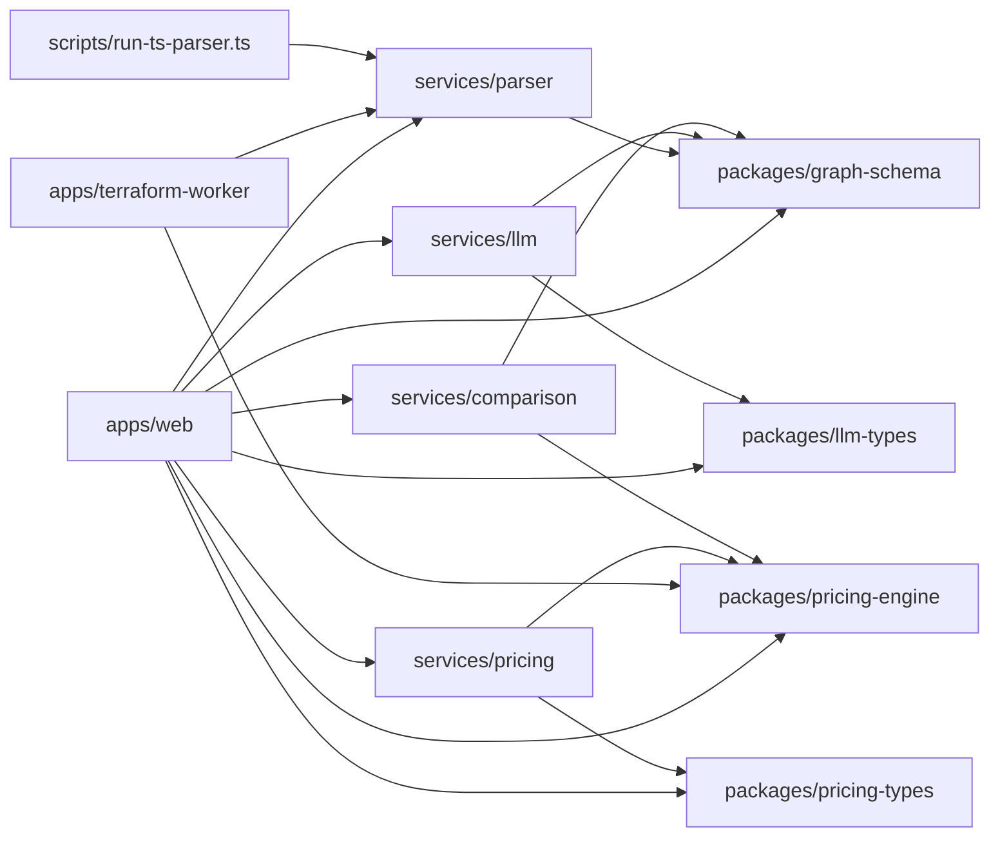

# Repository Map

## Overview

This repository is organized as a multi-runtime monorepo with a browser/web application, several backend services, shared packages, a worker app, and utility scripts. The layout strongly suggests a clear separation between:

- **`apps/`**: user-facing runtimes and application shells
- **`services/`**: backend or domain services with focused responsibilities
- **`packages/`**: reusable shared libraries and type contracts
- **`scripts/`**: developer tooling and one-off utilities

This page focuses on the **repository structure** rather than internals. It maps the top-level tree, explains what each directory is for, and identifies which entry points belong to which runtime.

---

## Annotated Repository Tree

```text
.
├── apps/
│   ├── terraform-worker/
│   │   └── src/main.ts                # Worker/runtime entry point
│   └── web/
│       ├── next.config.ts             # Next.js configuration
│       ├── next-env.d.ts              # Next.js type declarations
│       └── src/
│           ├── app/
│           │   ├── layout.tsx         # App root layout
│           │   ├── page.tsx           # Root page
│           │   ├── graph/page.tsx     # Graph view route
│           │   ├── settings/page.tsx  # Settings route
│           │   ├── upload/page.tsx    # Upload route
│           │   └── api/
│           │       ├── chat/route.ts   # Chat API route
│           │       ├── health/route.ts # Health check route
│           │       ├── parse/route.ts  # Parse API route
│           │       └── run/route.ts    # Run API route
│           ├── components/             # UI component library
│           ├── lib/                    # Browser-side state, storage, utilities
│           ├── stores/                 # UI/usage state stores
│           └── __tests__/              # Web app tests
├── packages/
│   ├── graph-schema/
│   │   └── src/index.ts               # Graph model contracts
│   ├── llm-types/
│   │   └── src/index.ts               # LLM recommendation contracts
│   ├── pricing-engine/
│   │   ├── src/index.ts               # Pricing engine entry point
│   │   ├── src/estimator.ts
│   │   ├── src/cost-table.ts
│   │   └── src/types.ts
│   └── pricing-types/
│       └── src/index.ts               # Shared pricing result contracts
├── services/
│   ├── comparison/
│   │   └── src/main.ts                # Comparison service entry point
│   ├── llm/
│   │   ├── src/main.ts                # LLM service entry point
│   │   ├── src/rules.ts               # Deterministic rules
│   │   └── src/__tests__/
│   ├── parser/
│   │   ├── src/main.ts                # Parser service entry point
│   │   ├── src/application/parse-plan.use-case.ts
│   │   ├── src/domain/plan-parser.ts
│   │   ├── src/domain/layer-classifier.ts
│   │   ├── src/domain/terraform-plan.types.ts
│   │   └── src/infrastructure/http/parser.routes.ts
│   └── pricing/
│       └── src/main.ts                # Pricing service entry point
├── scripts/
│   └── run-ts-parser.ts               # Utility script
├── vitest.config.ts                   # Test runner configuration
└── (tests colocated under apps/, services/)
```

### What stands out

- The **web app** is a Next.js application under `apps/web/src/app`, using route-based pages and route handlers.
- The **worker** is a separate runtime under `apps/terraform-worker`, with its own `src/main.ts`.
- The **backend services** are organized by business capability:
  - parsing Terraform plans,
  - generating LLM recommendations,
  - computing comparisons,
  - estimating pricing.
- Shared **packages** provide typed contracts and reusable pricing logic.
- Tests are present both in app/service folders and as top-level Vitest configuration.

> **Sources:** `apps/terraform-worker/src/main.ts` · `apps/web/next.config.ts` · `apps/web/next-env.d.ts` · `services/parser/src/main.ts` · `services/llm/src/main.ts` · `services/comparison/src/main.ts` · `services/pricing/src/main.ts` · `packages/graph-schema/src/index.ts` · `packages/llm-types/src/index.ts` · `packages/pricing-engine/src/index.ts` · `packages/pricing-types/src/index.ts` · `scripts/run-ts-parser.ts` · `vitest.config.ts`

---

## Top-Level Dependency View

The repository is intentionally layered: **apps** consume **packages** and call into **services**, while services may share common types and engine logic from packages.



This is a **top-level map only**: it shows dependency directions at a repository level without drilling into internal call sequences or component-level flows.

> **Sources:** `apps/web/src/app/api/run/route.ts` · `apps/web/src/app/api/parse/route.ts` · `apps/web/src/lib/server-api.ts` · `apps/web/src/lib/tauri-bridge.ts` · `apps/terraform-worker/src/main.ts` · `services/parser/src/main.ts` · `services/llm/src/main.ts` · `services/pricing/src/main.ts` · `services/comparison/src/main.ts` · `packages/graph-schema/src/index.ts` · `packages/llm-types/src/index.ts` · `packages/pricing-engine/src/index.ts` · `packages/pricing-types/src/index.ts` · `scripts/run-ts-parser.ts`

---

## Directory Map

| Directory                 | Purpose                                                    | Key Files                                                                                                                     | Notable Symbols                                                                                                                                                                                                                                                                                                                                                  |
| ------------------------- | ---------------------------------------------------------- | ----------------------------------------------------------------------------------------------------------------------------- | ---------------------------------------------------------------------------------------------------------------------------------------------------------------------------------------------------------------------------------------------------------------------------------------------------------------------------------------------------------------- |
| `apps/web`                | Browser-facing Next.js application shell and UI            | `src/app/layout.tsx`, `src/app/page.tsx`, `src/app/graph/page.tsx`, `src/app/api/*/route.ts`, `src/components/*`, `src/lib/*` | [`RootLayout`](apps/web/src/app/layout.tsx#L11), [`RootPage`](apps/web/src/app/page.tsx#L3), [`GraphPage`](apps/web/src/app/graph/page.tsx#L32), [`UploadPage`](apps/web/src/app/upload/page.tsx#L3), [`SettingsPage`](apps/web/src/app/settings/page.tsx#L4), [`POST`](apps/web/src/app/api/run/route.ts#L12), [`GET`](apps/web/src/app/api/health/route.ts#L3) |
| `apps/terraform-worker`   | Worker/runtime entry point for Terraform-related execution | `src/main.ts`                                                                                                                 | [`RunRequest`](apps/terraform-worker/src/main.ts#L17)                                                                                                                                                                                                                                                                                                            |
| `packages/graph-schema`   | Shared graph model contract used by web and services       | `src/index.ts`                                                                                                                | [`GraphNode`](packages/graph-schema/src/index.ts#L25), [`GraphEdge`](packages/graph-schema/src/index.ts#L37), [`GraphModel`](packages/graph-schema/src/index.ts#L42)                                                                                                                                                                                             |
| `packages/llm-types`      | Shared types for LLM recommendation results                | `src/index.ts`                                                                                                                | [`Recommendation`](packages/llm-types/src/index.ts#L20), [`RecommendationResult`](packages/llm-types/src/index.ts#L31)                                                                                                                                                                                                                                           |
| `packages/pricing-engine` | Shared pricing calculation engine                          | `src/index.ts`, `src/estimator.ts`, `src/cost-table.ts`, `src/types.ts`                                                       | [`estimateCost`](packages/pricing-engine/src/estimator.ts#L6), [`totalMonthlyCost`](packages/pricing-engine/src/estimator.ts#L18), [`costByProvider`](packages/pricing-engine/src/estimator.ts#L26), [`CostEstimate`](packages/pricing-engine/src/types.ts#L1), [`BreakdownItem`](packages/pricing-engine/src/types.ts#L12)                                      |
| `packages/pricing-types`  | Shared pricing output/result contracts                     | `src/index.ts`                                                                                                                | [`ResourceEstimate`](packages/pricing-types/src/index.ts#L9), [`CostLineItem`](packages/pricing-types/src/index.ts#L19), [`PricingResult`](packages/pricing-types/src/index.ts#L26)                                                                                                                                                                              |
| `services/parser`         | Terraform plan parsing service and HTTP surface            | `src/main.ts`, `src/application/parse-plan.use-case.ts`, `src/domain/*`, `src/infrastructure/http/parser.routes.ts`           | [`parsePlanUseCase`](services/parser/src/application/parse-plan.use-case.ts#L19), [`buildGraphModel`](services/parser/src/domain/plan-parser.ts#L79), [`classifyResource`](services/parser/src/domain/layer-classifier.ts#L271), [`TerraformPlan`](services/parser/src/domain/terraform-plan.types.ts#L35)                                                       |
| `services/llm`            | LLM recommendation service and deterministic rule checks   | `src/main.ts`, `src/rules.ts`                                                                                                 | [`callLlm`](services/llm/src/main.ts#L28), [`buildPrompt`](services/llm/src/main.ts#L44), [`runDeterministicRules`](services/llm/src/rules.ts#L155)                                                                                                                                                                                                              |
| `services/pricing`        | Pricing service entry point                                | `src/main.ts`                                                                                                                 | [`estimateNode`](services/pricing/src/main.ts#L20)                                                                                                                                                                                                                                                                                                               |
| `services/comparison`     | Comparison/diff service entry point                        | `src/main.ts`                                                                                                                 | [`fetchWithTimeout`](services/comparison/src/main.ts#L8), [`roughMonthlyFallback`](services/comparison/src/main.ts#L28), [`estimateViaPricingService`](services/comparison/src/main.ts#L32)                                                                                                                                                                      |
| `scripts`                 | Developer utility scripts                                  | `run-ts-parser.ts`                                                                                                            | Script entry point for parser execution                                                                                                                                                                                                                                                                                                                          |
| Repository root           | Test config and monorepo orchestration context             | `vitest.config.ts`                                                                                                            | Vitest runner configuration                                                                                                                                                                                                                                                                                                                                      |

> **Sources:** `apps/web/src/app/layout.tsx` · `apps/web/src/app/page.tsx` · `apps/web/src/app/graph/page.tsx` · `apps/web/src/app/upload/page.tsx` · `apps/web/src/app/settings/page.tsx` · `apps/web/src/app/api/run/route.ts` · `apps/web/src/app/api/health/route.ts` · `apps/terraform-worker/src/main.ts` · `packages/graph-schema/src/index.ts` · `packages/llm-types/src/index.ts` · `packages/pricing-engine/src/estimator.ts` · `packages/pricing-engine/src/types.ts` · `packages/pricing-types/src/index.ts` · `services/parser/src/application/parse-plan.use-case.ts` · `services/parser/src/domain/plan-parser.ts` · `services/parser/src/domain/layer-classifier.ts` · `services/parser/src/domain/terraform-plan.types.ts` · `services/llm/src/main.ts` · `services/llm/src/rules.ts` · `services/pricing/src/main.ts` · `services/comparison/src/main.ts` · `vitest.config.ts`

---

## Apps, Services, and Packages

### `apps/web`: browser runtime and route-driven UI

The web app is the primary user-facing runtime. Its structure follows the Next.js App Router pattern, with route pages under `src/app/` and route handlers under `src/app/api/`. Key entry points include [`RootLayout`](apps/web/src/app/layout.tsx#L11), [`RootPage`](apps/web/src/app/page.tsx#L3), [`GraphPage`](apps/web/src/app/graph/page.tsx#L32), [`UploadPage`](apps/web/src/app/upload/page.tsx#L3), and [`SettingsPage`](apps/web/src/app/settings/page.tsx#L4).

The API layer is also embedded in the app runtime via route handlers such as [`POST`](apps/web/src/app/api/run/route.ts#L12), [`GET`](apps/web/src/app/api/health/route.ts#L3), and the parse/chat routes. This means `apps/web` is not just static UI; it is a **hybrid browser/server runtime** with both frontend and backend-adjacent entry points.

Supporting logic lives in `src/lib/` and `src/stores/`, which include plan storage, URL encoding, theme persistence, and UI state management. The `src/components/` tree is a conventional feature-oriented component library for graph views, chat, settings, layout, and upload flows.

### `apps/terraform-worker`: worker runtime

The worker has a single visible entry point, [`RunRequest`](apps/terraform-worker/src/main.ts#L17) in `src/main.ts`. Based on the repository shape, this is a separate execution target from the browser app and services. The analysis data does not expose more internals, so the observable fact is simply that it is a dedicated runtime with a top-level main file.

### `services/*`: backend/domain services

Each service in `services/` has its own `src/main.ts` entry point:

- `services/parser` exposes parsing and model-building logic through `parse-plan.use-case.ts` and the HTTP route layer in `infrastructure/http/parser.routes.ts`.
- `services/llm` contains [`buildClient`](services/llm/src/main.ts#L23), [`callLlm`](services/llm/src/main.ts#L28), [`buildPrompt`](services/llm/src/main.ts#L44), and deterministic rule checks in [`runDeterministicRules`](services/llm/src/rules.ts#L155).
- `services/pricing` exposes [`estimateNode`](services/pricing/src/main.ts#L20).
- `services/comparison` provides comparison support with [`fetchWithTimeout`](services/comparison/src/main.ts#L8) and fallback estimation helpers.

### `packages/*`: shared contracts and engines

The packages are primarily **shared code boundaries** rather than application runtimes. They house model contracts and reusable logic used across apps and services:

- `packages/graph-schema` defines [`GraphNode`](packages/graph-schema/src/index.ts#L25), [`GraphEdge`](packages/graph-schema/src/index.ts#L37), and [`GraphModel`](packages/graph-schema/src/index.ts#L42).
- `packages/llm-types` defines LLM response/result contracts.
- `packages/pricing-engine` provides reusable pricing computations.
- `packages/pricing-types` contains output types consumed by pricing-related code.

> **Sources:** `apps/web/src/app/layout.tsx` · `apps/web/src/app/page.tsx` · `apps/web/src/app/graph/page.tsx` · `apps/web/src/app/upload/page.tsx` · `apps/web/src/app/settings/page.tsx` · `apps/web/src/app/api/run/route.ts` · `apps/web/src/app/api/health/route.ts` · `apps/web/src/lib/server-api.ts` · `apps/web/src/lib/tauri-bridge.ts` · `apps/terraform-worker/src/main.ts` · `services/parser/src/main.ts` · `services/parser/src/application/parse-plan.use-case.ts` · `services/parser/src/infrastructure/http/parser.routes.ts` · `services/llm/src/main.ts` · `services/llm/src/rules.ts` · `services/pricing/src/main.ts` · `services/comparison/src/main.ts` · `packages/graph-schema/src/index.ts` · `packages/llm-types/src/index.ts` · `packages/pricing-engine/src/index.ts` · `packages/pricing-types/src/index.ts`

---

## Runtime Entry Points

This repository contains multiple entry points, each tied to a different runtime:

| Entry Point                            | Runtime                | Role                         |
| -------------------------------------- | ---------------------- | ---------------------------- |
| `apps/web/src/app/layout.tsx`          | Next.js web app        | Root layout for all routes   |
| `apps/web/src/app/page.tsx`            | Next.js web app        | Landing/home page            |
| `apps/web/src/app/graph/page.tsx`      | Next.js web app        | Graph visualization route    |
| `apps/web/src/app/upload/page.tsx`     | Next.js web app        | Upload route                 |
| `apps/web/src/app/settings/page.tsx`   | Next.js web app        | Settings route               |
| `apps/web/src/app/api/chat/route.ts`   | Next.js server route   | Chat API endpoint            |
| `apps/web/src/app/api/health/route.ts` | Next.js server route   | Health check endpoint        |
| `apps/web/src/app/api/parse/route.ts`  | Next.js server route   | Parse endpoint               |
| `apps/web/src/app/api/run/route.ts`    | Next.js server route   | Run endpoint                 |
| `apps/terraform-worker/src/main.ts`    | Worker/runtime process | Terraform worker entry point |
| `services/parser/src/main.ts`          | Service process        | Parser service bootstrap     |
| `services/llm/src/main.ts`             | Service process        | LLM service bootstrap        |
| `services/pricing/src/main.ts`         | Service process        | Pricing service bootstrap    |
| `services/comparison/src/main.ts`      | Service process        | Comparison service bootstrap |
| `packages/*/src/index.ts`              | Library entry points   | Package public APIs          |
| `scripts/run-ts-parser.ts`             | Script runtime         | Utility script               |

A useful way to interpret the repository is:

- **Next.js runtime**: `apps/web`
- **Worker process**: `apps/terraform-worker`
- **Backend service processes**: `services/*`
- **Shared libraries**: `packages/*`
- **One-off tooling**: `scripts/*`

> **Sources:** `apps/web/src/app/layout.tsx` · `apps/web/src/app/page.tsx` · `apps/web/src/app/graph/page.tsx` · `apps/web/src/app/upload/page.tsx` · `apps/web/src/app/settings/page.tsx` · `apps/web/src/app/api/chat/route.ts` · `apps/web/src/app/api/health/route.ts` · `apps/web/src/app/api/parse/route.ts` · `apps/web/src/app/api/run/route.ts` · `apps/terraform-worker/src/main.ts` · `services/parser/src/main.ts` · `services/llm/src/main.ts` · `services/pricing/src/main.ts` · `services/comparison/src/main.ts` · `packages/graph-schema/src/index.ts` · `packages/llm-types/src/index.ts` · `packages/pricing-engine/src/index.ts` · `packages/pricing-types/src/index.ts` · `scripts/run-ts-parser.ts`

---

## Root Layout and Supporting Files

The repository root is lightweight and primarily contains orchestration/configuration assets rather than application code. The notable root file visible in the analysis is [`vitest.config.ts`](vitest.config.ts), which indicates the repository uses Vitest for testing across multiple subprojects.

The presence of colocated `__tests__` directories under both `apps/web` and the service folders suggests a test strategy that is close to implementation code rather than centralized in a single top-level test tree.

The `scripts/` directory houses operational tooling, with `run-ts-parser.ts` acting as a utility script rather than a deployed service. This is consistent with a monorepo that includes both runtime code and developer-focused maintenance or inspection tools.

> **Sources:** `vitest.config.ts` · `scripts/run-ts-parser.ts` · `apps/web/src/__tests__/GraphFilterBar.test.tsx` · `apps/web/src/__tests__/plan-diff.test.ts` · `apps/web/src/__tests__/plan-store.test.ts` · `services/comparison/src/__tests__/diff.test.ts` · `services/llm/src/__tests__/rules.test.ts` · `services/parser/src/__tests__/parse-plan.test.ts` · `services/pricing/src/__tests__/pricing.test.ts`
