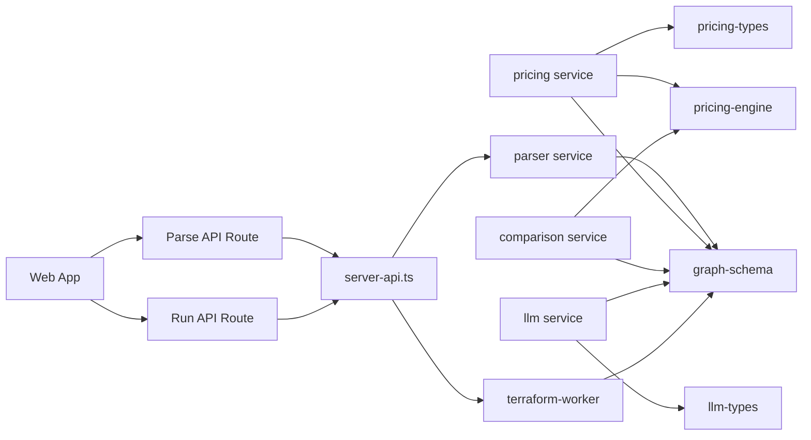

# Backend Service Applications

## Overview

This page documents the backend service applications as a single grouped subsystem, with emphasis on service boundaries, orchestration, and how they connect to the shared packages and the web app. The codebase is organized around several small HTTP services and one worker-style application:

- [`parser`](services/parser/src/main.ts) turns raw Terraform plan JSON into a normalized graph model.
- [`pricing`](services/pricing/src/main.ts) exposes cost estimation functionality backed by the pricing engine package.
- [`comparison`](services/comparison/src/main.ts) compares graph models and can fall back to a rough pricing-based estimate.
- [`llm`](services/llm/src/main.ts) builds prompts, applies deterministic policy checks, and calls the OpenAI client.
- [`terraform-worker`](apps/terraform-worker/src/main.ts) is a worker application with a request-driven contract for Terraform execution.

The shared model types are centered on [`GraphNode`](packages/graph-schema/src/index.ts#L25), [`GraphEdge`](packages/graph-schema/src/index.ts#L37), and [`GraphModel`](packages/graph-schema/src/index.ts#L42), which are imported broadly by the services and the web app. A second shared boundary is the pricing contract defined in [`CostEstimate`](packages/pricing-engine/src/types.ts#L1), [`BreakdownItem`](packages/pricing-engine/src/types.ts#L12), [`ResourceEstimate`](packages/pricing-types/src/index.ts#L9), and [`PricingResult`](packages/pricing-types/src/index.ts#L26). The LLM service uses [`Recommendation`](packages/llm-types/src/index.ts#L20) and [`RecommendationResult`](packages/llm-types/src/index.ts#L31).

> **Sources:** `services/parser/src/main.ts`, `services/pricing/src/main.ts`, `services/comparison/src/main.ts`, `services/llm/src/main.ts`, `apps/terraform-worker/src/main.ts` · `packages/graph-schema/src/index.ts` · `packages/pricing-engine/src/types.ts` · `packages/pricing-types/src/index.ts` · `packages/llm-types/src/index.ts`

## Service Catalog

The table below summarizes each service boundary, its entry file, its public role in the system, and the most important symbols visible in the analysis data.

| Service name     | Entry file                                                               | Public role                                                                                                        | Key symbols                                                                                                                                                                                                                     |
| ---------------- | ------------------------------------------------------------------------ | ------------------------------------------------------------------------------------------------------------------ | ------------------------------------------------------------------------------------------------------------------------------------------------------------------------------------------------------------------------------- |
| parser           | [`services/parser/src/main.ts`](services/parser/src/main.ts)             | HTTP service for converting Terraform plans into [`GraphModel`](packages/graph-schema/src/index.ts#L42) structures | [`parsePlanUseCase`](services/parser/src/application/parse-plan.use-case.ts#L19), [`buildGraphModel`](services/parser/src/domain/plan-parser.ts#L79), [`classifyResource`](services/parser/src/domain/layer-classifier.ts#L271) |
| pricing          | [`services/pricing/src/main.ts`](services/pricing/src/main.ts)           | HTTP service for estimating cost from graph nodes and returning pricing results                                    | [`estimateNode`](services/pricing/src/main.ts#L20), [`estimateCost`](packages/pricing-engine/src/estimator.ts#L6), [`totalMonthlyCost`](packages/pricing-engine/src/estimator.ts#L18)                                           |
| comparison       | [`services/comparison/src/main.ts`](services/comparison/src/main.ts)     | HTTP service for model comparison and pricing-assisted fallback estimation                                         | [`estimateViaPricingService`](services/comparison/src/main.ts#L32), [`roughMonthlyFallback`](services/comparison/src/main.ts#L28), [`fetchWithTimeout`](services/comparison/src/main.ts#L8)                                     |
| llm              | [`services/llm/src/main.ts`](services/llm/src/main.ts)                   | HTTP service that turns graph input into LLM-backed recommendations and deterministic policy checks                | [`buildClient`](services/llm/src/main.ts#L23), [`callLlm`](services/llm/src/main.ts#L28), [`buildPrompt`](services/llm/src/main.ts#L44), [`runDeterministicRules`](services/llm/src/rules.ts#L155)                              |
| terraform-worker | [`apps/terraform-worker/src/main.ts`](apps/terraform-worker/src/main.ts) | Worker application that receives a structured run request and orchestrates Terraform execution                     | [`RunRequest`](apps/terraform-worker/src/main.ts#L17)                                                                                                                                                                           |

> **Sources:** `services/parser/src/main.ts` · `services/pricing/src/main.ts` · `services/comparison/src/main.ts` · `services/llm/src/main.ts` · `apps/terraform-worker/src/main.ts` · relevant symbol files as linked above

## Parser Service

The parser service is responsible for taking raw Terraform plan data and normalizing it into the shared graph schema. Its main orchestration entry point is [`services/parser/src/main.ts`](services/parser/src/main.ts), which wires Express to the HTTP route layer in [`services/parser/src/infrastructure/http/parser.routes.ts`](services/parser/src/infrastructure/http/parser.routes.ts). At the application boundary, [`parsePlanUseCase`](services/parser/src/application/parse-plan.use-case.ts#L19) validates that the input is a Terraform plan and delegates to the domain parser. The core graph construction happens in [`buildGraphModel`](services/parser/src/domain/plan-parser.ts#L79), which composes [`flattenResources`](services/parser/src/domain/plan-parser.ts#L11), [`resolveChangeAction`](services/parser/src/domain/plan-parser.ts#L28), [`buildNode`](services/parser/src/domain/plan-parser.ts#L43), and [`buildEdges`](services/parser/src/domain/plan-parser.ts#L62). Classification is separated into [`classifyResource`](services/parser/src/domain/layer-classifier.ts#L271) and related provider-specific helpers.

From a service-boundary perspective, this service is the ingestion layer for all downstream consumers. The parser does not own presentation or pricing; it emits normalized [`GraphModel`](packages/graph-schema/src/index.ts#L42) data that is then consumed by the web app, pricing service, comparison service, and LLM service.

> **Sources:** `services/parser/src/main.ts` · `services/parser/src/application/parse-plan.use-case.ts` · `services/parser/src/domain/plan-parser.ts` · `services/parser/src/domain/layer-classifier.ts` · `services/parser/src/domain/terraform-plan.types.ts`

## Pricing Service

The pricing service provides a narrow HTTP façade over the pricing engine package. Its entry point is [`services/pricing/src/main.ts`](services/pricing/src/main.ts), which imports the engine from [`@terraform-viz/pricing-engine`](packages/pricing-engine/src/estimator.ts) and uses the shared graph schema types. The visible public function is [`estimateNode`](services/pricing/src/main.ts#L20), which suggests the service estimates a single graph node at the boundary and then delegates the detailed work to the package-level functions [`estimateCost`](packages/pricing-engine/src/estimator.ts#L6), [`totalMonthlyCost`](packages/pricing-engine/src/estimator.ts#L18), and [`costByProvider`](packages/pricing-engine/src/estimator.ts#L26).

This service’s responsibility is orchestration and transport: accept graph-shaped input, normalize it into pricing requests, and return structured pricing outputs in the [`PricingResult`](packages/pricing-types/src/index.ts#L26) family. The underlying algorithmic pricing tables live in shared packages, so this page treats the service itself as the deployable boundary rather than the algorithm implementation.

> **Sources:** `services/pricing/src/main.ts` · `packages/pricing-engine/src/estimator.ts` · `packages/pricing-engine/src/types.ts` · `packages/pricing-types/src/index.ts` · `packages/pricing-engine/src/cost-table.ts`

## Comparison Service

The comparison service sits between the graph model and pricing-assisted analysis. Its entry point is [`services/comparison/src/main.ts`](services/comparison/src/main.ts), which imports the shared graph schema and the pricing engine package. The key orchestration symbols are [`estimateViaPricingService`](services/comparison/src/main.ts#L32), [`roughMonthlyFallback`](services/comparison/src/main.ts#L28), and [`fetchWithTimeout`](services/comparison/src/main.ts#L8). This indicates the service is designed to talk to another HTTP pricing endpoint, with a fallback path when that interaction is unavailable or incomplete.

Its public role is therefore comparison-oriented orchestration: it consumes graph models, coordinates remote estimation, and produces a result that can be used to compare plans or degrade gracefully to an approximate estimate. Because the analysis data only exposes the service entry and helper symbols, the exact shape of the diff response is not expanded here; the important boundary is that this application coordinates between external service calls and shared pricing/model packages.

> **Sources:** `services/comparison/src/main.ts` · `services/comparison/src/__tests__/diff.test.ts` · `packages/graph-schema/src/index.ts` · `packages/pricing-engine/src/types.ts`

## LLM Service

The LLM service is the intelligence/orchestration boundary for rule-driven recommendations. Its entry point is [`services/llm/src/main.ts`](services/llm/src/main.ts), which imports OpenAI, the shared graph schema, and the recommendation types. The core orchestration functions are [`buildClient`](services/llm/src/main.ts#L23), [`callLlm`](services/llm/src/main.ts#L28), and [`buildPrompt`](services/llm/src/main.ts#L44). In addition, the service contains deterministic rules in [`services/llm/src/rules.ts`](services/llm/src/rules.ts), including [`checkNoDatabase`](services/llm/src/rules.ts#L11), [`checkPublicS3`](services/llm/src/rules.ts#L67), [`checkOversizedInstances`](services/llm/src/rules.ts#L110), and the aggregate [`runDeterministicRules`](services/llm/src/rules.ts#L155).

At the service boundary, this application combines rule evaluation with model prompting. It does not own graph generation or pricing; instead it consumes [`GraphModel`](packages/graph-schema/src/index.ts#L42) input and emits recommendation-oriented output described by [`Recommendation`](packages/llm-types/src/index.ts#L20) and [`RecommendationResult`](packages/llm-types/src/index.ts#L31). This makes it the policy and suggestion layer of the backend suite.

> **Sources:** `services/llm/src/main.ts` · `services/llm/src/rules.ts` · `packages/graph-schema/src/index.ts` · `packages/llm-types/src/index.ts`

## Terraform Worker

The terraform-worker is a worker-style application rather than a conventional REST service. Its entry file is [`apps/terraform-worker/src/main.ts`](apps/terraform-worker/src/main.ts), and the main visible contract is [`RunRequest`](apps/terraform-worker/src/main.ts#L17). The imported modules show a small runtime footprint focused on Express-style HTTP, child process execution, filesystem and path handling, and temporary directory operations via Node built-ins.

Its responsibility is to accept a structured run request and execute Terraform-related work on behalf of the rest of the system. Unlike the parser, pricing, comparison, and LLM services, this worker is operational rather than analytical. It appears to be the service that turns a run instruction into actual execution, file handling, and process orchestration.

> **Sources:** `apps/terraform-worker/src/main.ts`

## Service Orchestration and Shared Packages

The backend services are intentionally thin at the transport layer and share a small set of core packages for schema and result typing. The web app consumes these services through its own API routes, especially [`apps/web/src/app/api/parse/route.ts`](apps/web/src/app/api/parse/route.ts), [`apps/web/src/app/api/run/route.ts`](apps/web/src/app/api/run/route.ts), and [`apps/web/src/lib/server-api.ts`](apps/web/src/lib/server-api.ts). The web graph view at [`apps/web/src/app/graph/page.tsx`](apps/web/src/app/graph/page.tsx) pulls together the parsed graph, pricing overlays, diffing UI, and chat panel, which makes the backend services appear as one orchestration surface from the user’s perspective.

The shared packages act as the stabilizing layer between services:

- [`packages/graph-schema/src/index.ts`](packages/graph-schema/src/index.ts) defines the graph contract used by parser, pricing, comparison, llm, and the web app.
- [`packages/pricing-engine/src/estimator.ts`](packages/pricing-engine/src/estimator.ts) and [`packages/pricing-types/src/index.ts`](packages/pricing-types/src/index.ts) separate the pricing model from service transport.
- [`packages/llm-types/src/index.ts`](packages/llm-types/src/index.ts) isolates LLM request/result types from the service implementation.

This structure keeps orchestration concerns in the services and shared-data concerns in packages. In practical terms, the services are integration shells around a common data model, which reduces coupling between deployments while preserving a single conceptual graph domain.

> **Sources:** `apps/web/src/app/api/parse/route.ts` · `apps/web/src/app/api/run/route.ts` · `apps/web/src/lib/server-api.ts` · `apps/web/src/app/graph/page.tsx` · `packages/graph-schema/src/index.ts` · `packages/pricing-engine/src/estimator.ts` · `packages/pricing-types/src/index.ts` · `packages/llm-types/src/index.ts`

## Cross-Module Dependency Table

The table below captures the main service-to-package relationships and who orchestrates whom. It is intentionally focused on module boundaries rather than internal algorithms.

| Module           | Imports From                                                                                   | Called By                       | Calls Into                                                              | Inherits From |
| ---------------- | ---------------------------------------------------------------------------------------------- | ------------------------------- | ----------------------------------------------------------------------- | ------------- |
| parser           | `@terraform-viz/graph-schema`                                                                  | web API parse route, scripts    | `parsePlanUseCase`, `buildGraphModel`, `classifyResource`               | —             |
| pricing          | `@terraform-viz/graph-schema`, `@terraform-viz/pricing-engine`, `@terraform-viz/pricing-types` | web graph UI, pricing consumers | `estimateCost`, `totalMonthlyCost`, `costByProvider`                    | —             |
| comparison       | `@terraform-viz/graph-schema`, `@terraform-viz/pricing-engine`                                 | web graph UI / API consumers    | `fetchWithTimeout`, `roughMonthlyFallback`, `estimateViaPricingService` | —             |
| llm              | `@terraform-viz/graph-schema`, `@terraform-viz/llm-types`, `openai`                            | web chat flow                   | `buildClient`, `callLlm`, `buildPrompt`, `runDeterministicRules`        | —             |
| terraform-worker | Node built-ins, `express`, `zod`                                                               | web run flow                    | child-process and filesystem execution paths (via imports)              | —             |

## Relationship Summary

The extracted relationship data shows a backend centered on import-based shared contracts and service-level orchestration. For the services covered on this page, the primary dependency pattern is:

- many-to-one import usage of [`GraphModel`](packages/graph-schema/src/index.ts#L42) across all services;
- service-specific imports into pricing and LLM packages for output typing;
- orchestration from the web app into backend services via its API routes and server API helpers.

The key design signal is that the services are not tightly coupled to each other directly. Instead, they coordinate through shared schema packages and the web application’s HTTP-facing entry points. That makes each service independently deployable while keeping the domain model consistent.

> **Sources:** `services/parser/src/main.ts` · `services/pricing/src/main.ts` · `services/comparison/src/main.ts` · `services/llm/src/main.ts` · `apps/terraform-worker/src/main.ts` · `apps/web/src/app/api/parse/route.ts` · `apps/web/src/app/api/run/route.ts` · `apps/web/src/lib/server-api.ts`
