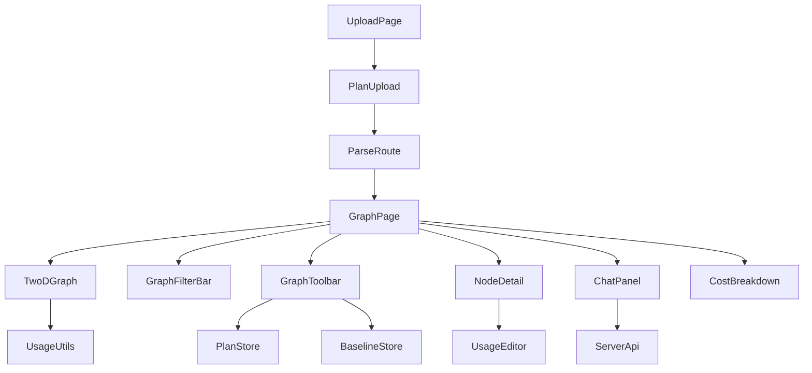

# Next.js Web Application Overview

## Scope and purpose

This page documents the Next.js web application under `apps/web/src` as a cohesive module. The focus is on how the app is structured around routing, screens, layout and theming, graph visualization, upload/chat flows, and local storage utilities. The page intentionally stays on the client/UI side and only references backend services where the web app calls them through its API routes or shared client helpers.

The web app is built around the App Router entry points [`RootLayout`](apps/web/src/app/layout.tsx#L11), [`RootPage`](apps/web/src/app/page.tsx#L3), [`UploadPage`](apps/web/src/app/upload/page.tsx#L3), [`GraphPage`](apps/web/src/app/graph/page.tsx#L32), and [`SettingsPage`](apps/web/src/app/settings/page.tsx#L4). Supporting these routes are reusable layout components such as [`ClientShell`](apps/web/src/components/layout/ClientShell.tsx#L14), [`Sidebar`](apps/web/src/components/layout/Sidebar.tsx#L107), [`ThemeProvider`](apps/web/src/components/layout/ThemeProvider.tsx#L17), and the graph-specific UI in `apps/web/src/components/graph`.

The app’s core data model is the shared [`GraphModel`](packages/graph-schema/src/index.ts#L42), with per-node details exposed through [`GraphNode`](packages/graph-schema/src/index.ts#L25) and [`GraphEdge`](packages/graph-schema/src/index.ts#L37). These types flow through upload, parsing, visualization, storage, and chat interactions.

> **Sources:** `apps/web/src/app/layout.tsx` · L11–L11 · [`RootLayout`](apps/web/src/app/layout.tsx#L11); `apps/web/src/app/page.tsx` · L3–L3 · [`RootPage`](apps/web/src/app/page.tsx#L3); `apps/web/src/app/upload/page.tsx` · L3–L3 · [`UploadPage`](apps/web/src/app/upload/page.tsx#L3); `apps/web/src/app/graph/page.tsx` · L32–L32 · [`GraphPage`](apps/web/src/app/graph/page.tsx#L32); `apps/web/src/app/settings/page.tsx` · L4–L4 · [`SettingsPage`](apps/web/src/app/settings/page.tsx#L4)

## Routing and screens

The routing layer is straightforward and screen-oriented. The root route [`RootPage`](apps/web/src/app/page.tsx#L3) imports `next/navigation`, which strongly suggests a redirect/landing role rather than a complex UI of its own. From the visible route set, the app exposes dedicated screens for upload, graph exploration, and settings.

### Screen map

| Route         | Component                                               | Purpose                                      |
| ------------- | ------------------------------------------------------- | -------------------------------------------- |
| `/`           | [`RootPage`](apps/web/src/app/page.tsx#L3)              | Entry route / landing behavior               |
| `/upload`     | [`UploadPage`](apps/web/src/app/upload/page.tsx#L3)     | File upload and plan import                  |
| `/graph`      | [`GraphPage`](apps/web/src/app/graph/page.tsx#L32)      | Main visualization and analysis workspace    |
| `/settings`   | [`SettingsPage`](apps/web/src/app/settings/page.tsx#L4) | User configuration for theme and LLM options |
| `/api/chat`   | [`POST`](apps/web/src/app/api/chat/route.ts#L9)         | Chat endpoint used by the web UI             |
| `/api/health` | [`GET`](apps/web/src/app/api/health/route.ts#L3)        | Health check                                 |
| `/api/parse`  | [`POST`](apps/web/src/app/api/parse/route.ts#L5)        | Parse Terraform plan payloads                |
| `/api/run`    | [`POST`](apps/web/src/app/api/run/route.ts#L12)         | Trigger plan execution / run workflow        |

The route handlers live under `apps/web/src/app/api` and act as thin application-level adapters around shared client helpers like [`parsePlan`](apps/web/src/lib/server-api.ts#L26) and [`runPlan`](apps/web/src/lib/server-api.ts#L56). The UI itself also depends heavily on the `GraphPage` composition model, where visual graph controls, detail panels, chat, and cost summaries are arranged in one screen.

### API route handlers

| Handler                                          | File                                   | Signature                    | Notes                        |
| ------------------------------------------------ | -------------------------------------- | ---------------------------- | ---------------------------- |
| [`POST`](apps/web/src/app/api/chat/route.ts#L9)  | `apps/web/src/app/api/chat/route.ts`   | `POST(request: NextRequest)` | Chat API entry point         |
| [`GET`](apps/web/src/app/api/health/route.ts#L3) | `apps/web/src/app/api/health/route.ts` | `GET()`                      | Minimal health probe         |
| [`POST`](apps/web/src/app/api/parse/route.ts#L5) | `apps/web/src/app/api/parse/route.ts`  | `POST(request: NextRequest)` | Parses uploaded plan content |
| [`POST`](apps/web/src/app/api/run/route.ts#L12)  | `apps/web/src/app/api/run/route.ts`    | `POST(request: NextRequest)` | Executes run workflow        |

> **Sources:** `apps/web/src/app/page.tsx` · L3–L3 · [`RootPage`](apps/web/src/app/page.tsx#L3); `apps/web/src/app/upload/page.tsx` · L3–L3 · [`UploadPage`](apps/web/src/app/upload/page.tsx#L3); `apps/web/src/app/graph/page.tsx` · L32–L32 · [`GraphPage`](apps/web/src/app/graph/page.tsx#L32); `apps/web/src/app/settings/page.tsx` · L4–L4 · [`SettingsPage`](apps/web/src/app/settings/page.tsx#L4); `apps/web/src/app/api/chat/route.ts` · L9–L9 · [`POST`](apps/web/src/app/api/chat/route.ts#L9); `apps/web/src/app/api/health/route.ts` · L3–L3 · [`GET`](apps/web/src/app/api/health/route.ts#L3); `apps/web/src/app/api/parse/route.ts` · L5–L5 · [`POST`](apps/web/src/app/api/parse/route.ts#L5); `apps/web/src/app/api/run/route.ts` · L12–L12 · [`POST`](apps/web/src/app/api/run/route.ts#L12)

## Layout and theming

The application shell is established by [`RootLayout`](apps/web/src/app/layout.tsx#L11), which imports `globals.css`, wraps content in [`ThemeProvider`](apps/web/src/components/layout/ThemeProvider.tsx#L17), and nests the main app UI under [`ClientShell`](apps/web/src/components/layout/ClientShell.tsx#L14). This is a classic App Router composition: global HTML/body scaffolding at the root, then a client-side shell that can manage navigation and persistent layout state.

### Major layout and theme components

| Component                                                                        | File                                                  | Role                                   |
| -------------------------------------------------------------------------------- | ----------------------------------------------------- | -------------------------------------- |
| [`RootLayout`](apps/web/src/app/layout.tsx#L11)                                  | `apps/web/src/app/layout.tsx`                         | HTML/body root and global wrappers     |
| [`ClientShell`](apps/web/src/components/layout/ClientShell.tsx#L14)              | `apps/web/src/components/layout/ClientShell.tsx`      | In-app shell, sidebar, resize behavior |
| [`Sidebar`](apps/web/src/components/layout/Sidebar.tsx#L107)                     | `apps/web/src/components/layout/Sidebar.tsx`          | Primary navigation and iconography     |
| [`ResizeHandle`](apps/web/src/components/layout/ResizeHandle.tsx#L14)            | `apps/web/src/components/layout/ResizeHandle.tsx`     | Resizable panel control                |
| [`ThemeProvider`](apps/web/src/components/layout/ThemeProvider.tsx#L17)          | `apps/web/src/components/layout/ThemeProvider.tsx`    | Theme state provider                   |
| [`useTheme`](apps/web/src/components/layout/ThemeProvider.tsx#L58)               | `apps/web/src/components/layout/ThemeProvider.tsx`    | Theme context hook                     |
| [`ThemeToggle`](apps/web/src/components/ui/ThemeToggle.tsx#L5)                   | `apps/web/src/components/ui/ThemeToggle.tsx`          | End-user theme toggle                  |
| [`StorageWarningBanner`](apps/web/src/components/ui/StorageWarningBanner.tsx#L5) | `apps/web/src/components/ui/StorageWarningBanner.tsx` | Warns when local storage usage is high |

The theme system is split between context/provider code and storage utilities. The provider exposes [`setTheme`](apps/web/src/components/layout/ThemeProvider.tsx#L41) and [`toggleTheme`](apps/web/src/components/layout/ThemeProvider.tsx#L47), while the storage helper module [`getStoredTheme`](apps/web/src/lib/theme-store.ts#L4), [`applyTheme`](apps/web/src/lib/theme-store.ts#L9), and [`toggleTheme`](apps/web/src/lib/theme-store.ts#L14) persists and applies the selected theme. That separation makes it easy for UI controls like [`ThemeToggle`](apps/web/src/components/ui/ThemeToggle.tsx#L5) and the settings screen [`ThemeSettings`](apps/web/src/components/settings/ThemeSettings.tsx#L5) to share the same underlying behavior.

`Sidebar` includes route icons such as [`IconGraph`](apps/web/src/components/layout/Sidebar.tsx#L7), [`IconUpload`](apps/web/src/components/layout/Sidebar.tsx#L28), [`IconChat`](apps/web/src/components/layout/Sidebar.tsx#L47), and [`IconSettings`](apps/web/src/components/layout/Sidebar.tsx#L64), making it the main navigation surface between the major app screens.

> **Sources:** `apps/web/src/app/layout.tsx` · L11–L11 · [`RootLayout`](apps/web/src/app/layout.tsx#L11); `apps/web/src/components/layout/ClientShell.tsx` · L14–L14 · [`ClientShell`](apps/web/src/components/layout/ClientShell.tsx#L14); `apps/web/src/components/layout/Sidebar.tsx` · L107–L107 · [`Sidebar`](apps/web/src/components/layout/Sidebar.tsx#L107); `apps/web/src/components/layout/ThemeProvider.tsx` · L17–L58 · [`ThemeProvider`](apps/web/src/components/layout/ThemeProvider.tsx#L17), [`useTheme`](apps/web/src/components/layout/ThemeProvider.tsx#L58); `apps/web/src/lib/theme-store.ts` · L4–L14 · [`getStoredTheme`](apps/web/src/lib/theme-store.ts#L4), [`applyTheme`](apps/web/src/lib/theme-store.ts#L9), [`toggleTheme`](apps/web/src/lib/theme-store.ts#L14)

## Graph visualization

The graph workspace is the center of the application. [`GraphPage`](apps/web/src/app/graph/page.tsx#L32) composes multiple visualization components around the shared [`GraphModel`](packages/graph-schema/src/index.ts#L42): a 2D graph renderer, filter controls, toolbar actions, node detail panels, diff/comparison views, cost summaries, and a chat panel.

### Visualization components

| Component                                                                | File                                               | Responsibility                               |
| ------------------------------------------------------------------------ | -------------------------------------------------- | -------------------------------------------- |
| [`_TwoDGraph`](apps/web/src/components/graph/TwoDGraph.tsx#L110)         | `apps/web/src/components/graph/TwoDGraph.tsx`      | D3-powered plan graph rendering              |
| [`buildLayout`](apps/web/src/components/graph/TwoDGraph.tsx#L74)         | `apps/web/src/components/graph/TwoDGraph.tsx`      | Compute node positions/layout                |
| [`GraphFilterBar`](apps/web/src/components/graph/GraphFilterBar.tsx#L60) | `apps/web/src/components/graph/GraphFilterBar.tsx` | Filter graph by action/layer/provider/tag    |
| [`GraphToolbar`](apps/web/src/components/graph/GraphToolbar.tsx#L11)     | `apps/web/src/components/graph/GraphToolbar.tsx`   | History, baseline, sharing, and view actions |
| [`NodeDetail`](apps/web/src/components/graph/NodeDetail.tsx#L156)        | `apps/web/src/components/graph/NodeDetail.tsx`     | Inspect node metadata and usage/cost details |
| [`UsageEditor`](apps/web/src/components/graph/UsageEditor.tsx#L9)        | `apps/web/src/components/graph/UsageEditor.tsx`    | Edit usage-based assumptions                 |
| [`CostBreakdown`](apps/web/src/components/graph/CostBreakdown.tsx#L23)   | `apps/web/src/components/graph/CostBreakdown.tsx`  | Aggregate cost summary                       |
| [`CompareView`](apps/web/src/components/graph/CompareView.tsx#L24)       | `apps/web/src/components/graph/CompareView.tsx`    | Compare current plan against another model   |
| [`DiffView`](apps/web/src/components/graph/DiffView.tsx#L7)              | `apps/web/src/components/graph/DiffView.tsx`       | Show `PlanDiff` results                      |

The graph screen also links to storage helpers such as [`loadPlan`](apps/web/src/lib/plan-store.ts#L54), [`loadHistory`](apps/web/src/lib/plan-store.ts#L93), [`loadBaseline`](apps/web/src/lib/baseline-store.ts#L22), and [`diffPlans`](apps/web/src/lib/plan-diff.ts#L29). This makes the graph view not just a renderer, but the control center for saved plans and comparison workflows.

[`GraphFilterBar`](apps/web/src/components/graph/GraphFilterBar.tsx#L60) exposes helper functions [`getNodeTags`](apps/web/src/components/graph/GraphFilterBar.tsx#L52), [`toggleAction`](apps/web/src/components/graph/GraphFilterBar.tsx#L74), [`toggleLayer`](apps/web/src/components/graph/GraphFilterBar.tsx#L81), [`toggleProvider`](apps/web/src/components/graph/GraphFilterBar.tsx#L88), [`toggleTag`](apps/web/src/components/graph/GraphFilterBar.tsx#L126), and [`clearAll`](apps/web/src/components/graph/GraphFilterBar.tsx#L95). The toolbar adds interactive shell behavior through [`onPointerDown`](apps/web/src/components/graph/GraphToolbar.tsx#L39), likely for drag, resize, or reordering gestures.

### Component interaction diagram

This diagram intentionally focuses on the main user flow: upload a plan, parse it, visualize it, inspect/edit node usage, and optionally invoke chat. It does not expand into backend internals; the only server-facing node is the web app’s own API/client boundary via [`parsePlan`](apps/web/src/lib/server-api.ts#L26) and [`runPlan`](apps/web/src/lib/server-api.ts#L56).

> **Sources:** `apps/web/src/app/graph/page.tsx` · L32–L32 · [`GraphPage`](apps/web/src/app/graph/page.tsx#L32); `apps/web/src/components/graph/TwoDGraph.tsx` · L74–L110 · [`buildLayout`](apps/web/src/components/graph/TwoDGraph.tsx#L74), [`_TwoDGraph`](apps/web/src/components/graph/TwoDGraph.tsx#L110); `apps/web/src/components/graph/GraphFilterBar.tsx` · L52–L144 · [`getNodeTags`](apps/web/src/components/graph/GraphFilterBar.tsx#L52), [`GraphFilterBar`](apps/web/src/components/graph/GraphFilterBar.tsx#L60); `apps/web/src/components/graph/GraphToolbar.tsx` · L11–L39 · [`GraphToolbar`](apps/web/src/components/graph/GraphToolbar.tsx#L11), [`onPointerDown`](apps/web/src/components/graph/GraphToolbar.tsx#L39); `apps/web/src/components/graph/NodeDetail.tsx` · L94–L156 · [`AttributesPanel`](apps/web/src/components/graph/NodeDetail.tsx#L94), [`NodeDetail`](apps/web/src/components/graph/NodeDetail.tsx#L156); `apps/web/src/components/graph/UsageEditor.tsx` · L9–L28 · [`UsageEditor`](apps/web/src/components/graph/UsageEditor.tsx#L9); `apps/web/src/components/graph/CostBreakdown.tsx` · L23–L23 · [`CostBreakdown`](apps/web/src/components/graph/CostBreakdown.tsx#L23); `apps/web/src/components/graph/CompareView.tsx` · L24–L24 · [`CompareView`](apps/web/src/components/graph/CompareView.tsx#L24); `apps/web/src/components/graph/DiffView.tsx` · L7–L7 · [`DiffView`](apps/web/src/components/graph/DiffView.tsx#L7)

## Upload and chat flows

The upload flow starts at [`UploadPage`](apps/web/src/app/upload/page.tsx#L3), which renders [`PlanUpload`](apps/web/src/components/upload/PlanUpload.tsx#L14). The component bridges file selection and plan intake with both browser and desktop contexts: it imports [`openPlanFile`](apps/web/src/lib/tauri-bridge.ts#L40) and related Tauri helpers, indicating the same UI can work in a web or desktop wrapper. Once a plan is available, the upload flow stores or forwards it via [`savePlan`](apps/web/src/lib/plan-store.ts#L39) and navigates the user toward the graph workspace.

The chat flow is centered in [`_ChatPanel`](apps/web/src/components/chat/ChatPanel.tsx#L447), which is used from the graph page and operates against the current plan and node context. The helper functions [`planContext`](apps/web/src/components/chat/ChatPanel.tsx#L49) and [`nodeContext`](apps/web/src/components/chat/ChatPanel.tsx#L65) build the contextual prompt state for plan-level and node-level conversations. The panel also includes message rendering helpers such as [`inlineMd`](apps/web/src/components/chat/ChatPanel.tsx#L233), [`parseMarkdown`](apps/web/src/components/chat/ChatPanel.tsx#L261), [`StreamingBubble`](apps/web/src/components/chat/ChatPanel.tsx#L364), and [`MessageBubble`](apps/web/src/components/chat/ChatPanel.tsx#L385), which together suggest streaming assistant responses with markdown-aware formatting.

### Flow characteristics

| Flow                   | Entry                                                                                                                   | Core helper(s)                                                                                                                   | Storage / API touchpoints                                          |
| ---------------------- | ----------------------------------------------------------------------------------------------------------------------- | -------------------------------------------------------------------------------------------------------------------------------- | ------------------------------------------------------------------ |
| Upload plan            | [`UploadPage`](apps/web/src/app/upload/page.tsx#L3) → [`PlanUpload`](apps/web/src/components/upload/PlanUpload.tsx#L14) | [`openPlanFile`](apps/web/src/lib/tauri-bridge.ts#L40), [`savePlan`](apps/web/src/lib/plan-store.ts#L39)                         | Local plan storage and Tauri bridge                                |
| Open graph             | [`GraphPage`](apps/web/src/app/graph/page.tsx#L32)                                                                      | [`loadPlan`](apps/web/src/lib/plan-store.ts#L54), [`loadHistory`](apps/web/src/lib/plan-store.ts#L93)                            | Local plan/history stores                                          |
| Chat with plan context | [`_ChatPanel`](apps/web/src/components/chat/ChatPanel.tsx#L447)                                                         | [`planContext`](apps/web/src/components/chat/ChatPanel.tsx#L49), [`nodeContext`](apps/web/src/components/chat/ChatPanel.tsx#L65) | Web app chat route [`POST`](apps/web/src/app/api/chat/route.ts#L9) |
| Parse plan payload     | API route [`POST`](apps/web/src/app/api/parse/route.ts#L5)                                                              | [`parsePlan`](apps/web/src/lib/server-api.ts#L26)                                                                                | Web app parse route                                                |
| Execute run workflow   | API route [`POST`](apps/web/src/app/api/run/route.ts#L12)                                                               | [`runPlan`](apps/web/src/lib/server-api.ts#L56)                                                                                  | Web app run route                                                  |

The only backend-facing details observable in the web app are the route handlers and client helpers. The actual services are not documented here; what matters is that the web app abstracts them through app-local entry points and keeps the user-facing experience in one place.

> **Sources:** `apps/web/src/app/upload/page.tsx` · L3–L3 · [`UploadPage`](apps/web/src/app/upload/page.tsx#L3); `apps/web/src/components/upload/PlanUpload.tsx` · L14–L14 · [`PlanUpload`](apps/web/src/components/upload/PlanUpload.tsx#L14); `apps/web/src/components/chat/ChatPanel.tsx` · L49–L447 · [`planContext`](apps/web/src/components/chat/ChatPanel.tsx#L49), [`nodeContext`](apps/web/src/components/chat/ChatPanel.tsx#L65), [`_ChatPanel`](apps/web/src/components/chat/ChatPanel.tsx#L447); `apps/web/src/lib/tauri-bridge.ts` · L40–L54 · [`openPlanFile`](apps/web/src/lib/tauri-bridge.ts#L40), [`estimateCosts`](apps/web/src/lib/tauri-bridge.ts#L54); `apps/web/src/lib/plan-store.ts` · L39–L99 · [`savePlan`](apps/web/src/lib/plan-store.ts#L39), [`loadPlan`](apps/web/src/lib/plan-store.ts#L54), [`saveToHistory`](apps/web/src/lib/plan-store.ts#L70), [`loadHistory`](apps/web/src/lib/plan-store.ts#L93); `apps/web/src/app/api/chat/route.ts` · L9–L9 · [`POST`](apps/web/src/app/api/chat/route.ts#L9); `apps/web/src/app/api/parse/route.ts` · L5–L5 · [`POST`](apps/web/src/app/api/parse/route.ts#L5); `apps/web/src/app/api/run/route.ts` · L12–L12 · [`POST`](apps/web/src/app/api/run/route.ts#L12)

## Local storage utilities

The web app uses a small set of local persistence helpers to keep user state available across reloads. These utilities are centered in `apps/web/src/lib` and are consumed by both the graph screen and supporting settings components.

### Storage helper modules

| Module                               | Key symbols                                                                                                                                                                                                                                                                                                                                                                                                                                                                                                                                                               | Purpose                             |
| ------------------------------------ | ------------------------------------------------------------------------------------------------------------------------------------------------------------------------------------------------------------------------------------------------------------------------------------------------------------------------------------------------------------------------------------------------------------------------------------------------------------------------------------------------------------------------------------------------------------------------- | ----------------------------------- |
| `apps/web/src/lib/plan-store.ts`     | [`StorageQuotaError`](apps/web/src/lib/plan-store.ts#L6), [`estimateLocalStorageUsage`](apps/web/src/lib/plan-store.ts#L11), [`isApproachingQuota`](apps/web/src/lib/plan-store.ts#L22), [`isAtQuota`](apps/web/src/lib/plan-store.ts#L29), [`savePlan`](apps/web/src/lib/plan-store.ts#L39), [`loadPlan`](apps/web/src/lib/plan-store.ts#L54), [`clearPlan`](apps/web/src/lib/plan-store.ts#L66), [`saveToHistory`](apps/web/src/lib/plan-store.ts#L70), [`loadHistory`](apps/web/src/lib/plan-store.ts#L93), [`removeHistoryEntry`](apps/web/src/lib/plan-store.ts#L99) | Persist plans and plan history      |
| `apps/web/src/lib/baseline-store.ts` | [`saveBaseline`](apps/web/src/lib/baseline-store.ts#L12), [`loadBaseline`](apps/web/src/lib/baseline-store.ts#L22), [`clearBaseline`](apps/web/src/lib/baseline-store.ts#L31)                                                                                                                                                                                                                                                                                                                                                                                             | Persist comparison baselines        |
| `apps/web/src/lib/plan-url.ts`       | [`compressToBase64`](apps/web/src/lib/plan-url.ts#L3), [`decompressFromBase64`](apps/web/src/lib/plan-url.ts#L29), [`encodePlan`](apps/web/src/lib/plan-url.ts#L64), [`decodePlan`](apps/web/src/lib/plan-url.ts#L66)                                                                                                                                                                                                                                                                                                                                                     | Share plans via encoded URLs        |
| `apps/web/src/lib/usage-utils.ts`    | [`loadUsageOverrides`](apps/web/src/lib/usage-utils.ts#L2), [`saveUsageOverride`](apps/web/src/lib/usage-utils.ts#L9), [`resetUsageOverride`](apps/web/src/lib/usage-utils.ts#L15), [`resetAllUsageOverrides`](apps/web/src/lib/usage-utils.ts#L20), [`applyUsageOverrides`](apps/web/src/lib/usage-utils.ts#L22)                                                                                                                                                                                                                                                         | Per-node usage override persistence |
| `apps/web/src/lib/theme-store.ts`    | [`getStoredTheme`](apps/web/src/lib/theme-store.ts#L4), [`applyTheme`](apps/web/src/lib/theme-store.ts#L9), [`toggleTheme`](apps/web/src/lib/theme-store.ts#L14)                                                                                                                                                                                                                                                                                                                                                                                                          | Theme persistence                   |

`plan-store.ts` is especially important because it contains quota-awareness through [`StorageQuotaError`](apps/web/src/lib/plan-store.ts#L6) and the usage estimation helpers [`estimateLocalStorageUsage`](apps/web/src/lib/plan-store.ts#L11), [`isApproachingQuota`](apps/web/src/lib/plan-store.ts#L22), and [`isAtQuota`](apps/web/src/lib/plan-store.ts#L29). That is surfaced in the UI by [`StorageWarningBanner`](apps/web/src/components/ui/StorageWarningBanner.tsx#L5), which is imported by [`ClientShell`](apps/web/src/components/layout/ClientShell.tsx#L14).

The app also stores baseline plans for comparison via [`saveBaseline`](apps/web/src/lib/baseline-store.ts#L12) and [`loadBaseline`](apps/web/src/lib/baseline-store.ts#L22). The diff workflow is powered by [`diffPlans`](apps/web/src/lib/plan-diff.ts#L29), which returns a [`PlanDiff`](apps/web/src/lib/plan-diff.ts#L14) composed of [`NodeDiffEntry`](apps/web/src/lib/plan-diff.ts#L6) items and a [`DiffKind`](apps/web/src/lib/plan-diff.ts#L4) classification.

> **Sources:** `apps/web/src/lib/plan-store.ts` · L6–L99 · [`StorageQuotaError`](apps/web/src/lib/plan-store.ts#L6), [`estimateLocalStorageUsage`](apps/web/src/lib/plan-store.ts#L11), [`isApproachingQuota`](apps/web/src/lib/plan-store.ts#L22), [`isAtQuota`](apps/web/src/lib/plan-store.ts#L29), [`savePlan`](apps/web/src/lib/plan-store.ts#L39), [`loadPlan`](apps/web/src/lib/plan-store.ts#L54), [`saveToHistory`](apps/web/src/lib/plan-store.ts#L70), [`loadHistory`](apps/web/src/lib/plan-store.ts#L93); `apps/web/src/lib/baseline-store.ts` · L12–L31 · [`saveBaseline`](apps/web/src/lib/baseline-store.ts#L12), [`loadBaseline`](apps/web/src/lib/baseline-store.ts#L22), [`clearBaseline`](apps/web/src/lib/baseline-store.ts#L31); `apps/web/src/lib/plan-url.ts` · L3–L66 · [`compressToBase64`](apps/web/src/lib/plan-url.ts#L3), [`encodePlan`](apps/web/src/lib/plan-url.ts#L64), [`decodePlan`](apps/web/src/lib/plan-url.ts#L66); `apps/web/src/lib/usage-utils.ts` · L2–L22 · [`loadUsageOverrides`](apps/web/src/lib/usage-utils.ts#L2), [`applyUsageOverrides`](apps/web/src/lib/usage-utils.ts#L22); `apps/web/src/lib/theme-store.ts` · L4–L14 · [`getStoredTheme`](apps/web/src/lib/theme-store.ts#L4), [`applyTheme`](apps/web/src/lib/theme-store.ts#L9), [`toggleTheme`](apps/web/src/lib/theme-store.ts#L14)

## Cross-module dependency table

| Module                             | Imports From                                                                                                                                                          | Called By                                          | Calls Into                                         | Inherits From |
| ---------------------------------- | --------------------------------------------------------------------------------------------------------------------------------------------------------------------- | -------------------------------------------------- | -------------------------------------------------- | ------------- |
| `apps/web/src/app/layout.tsx`      | `next`, [`ClientShell`](apps/web/src/components/layout/ClientShell.tsx#L14), [`ThemeProvider`](apps/web/src/components/layout/ThemeProvider.tsx#L17), `./globals.css` | App Router runtime                                 | `ClientShell`, `ThemeProvider`                     | —             |
| `apps/web/src/app/page.tsx`        | `next/navigation`                                                                                                                                                     | App Router runtime                                 | Navigation/redirect behavior                       | —             |
| `apps/web/src/app/upload/page.tsx` | [`PlanUpload`](apps/web/src/components/upload/PlanUpload.tsx#L14)                                                                                                     | App Router runtime                                 | `PlanUpload`                                       | —             |
| `apps/web/src/app/graph/page.tsx`  | `react`, [`TwoDGraph`](apps/web/src/components/graph/TwoDGraph.tsx#L110), [`ChatPanel`](apps/web/src/components/chat/ChatPanel.tsx#L447), storage helpers             | App Router runtime                                 | Graph UI, stores, diff helpers                     | —             |
| `apps/web/src/components/layout/*` | `react`, `next/link`, `next/navigation`, [`theme-store`](apps/web/src/lib/theme-store.ts#L4)                                                                          | `RootLayout`, route pages                          | Layout, theme, sidebar, resize UI                  | —             |
| `apps/web/src/components/graph/*`  | `react`, [`GraphModel`](packages/graph-schema/src/index.ts#L42), storage helpers, pricing helpers                                                                     | [`GraphPage`](apps/web/src/app/graph/page.tsx#L32) | Graph rendering, filtering, diffing, usage editing | —             |
| `apps/web/src/lib/*`               | shared schema and helper modules                                                                                                                                      | layout/graph/upload/components                     | local storage, URL encoding, server calls          | —             |
| `apps/web/src/app/api/*`           | `next/server`, [`server-api`](apps/web/src/lib/server-api.ts#L3)                                                                                                      | web app route handlers                             | parse/run/chat adapters                            | —             |

This module is cohesive because the same `GraphModel` data type flows through the entire UI, while persistence helpers and route handlers keep user actions connected across pages.

> **Sources:** `apps/web/src/app/layout.tsx` · L11–L11 · [`RootLayout`](apps/web/src/app/layout.tsx#L11); `apps/web/src/app/page.tsx` · L3–L3 · [`RootPage`](apps/web/src/app/page.tsx#L3); `apps/web/src/app/upload/page.tsx` · L3–L3 · [`UploadPage`](apps/web/src/app/upload/page.tsx#L3); `apps/web/src/app/graph/page.tsx` · L32–L32 · [`GraphPage`](apps/web/src/app/graph/page.tsx#L32); `apps/web/src/components/layout/ClientShell.tsx` · L14–L14 · [`ClientShell`](apps/web/src/components/layout/ClientShell.tsx#L14); `apps/web/src/components/layout/ThemeProvider.tsx` · L17–L58 · [`ThemeProvider`](apps/web/src/components/layout/ThemeProvider.tsx#L17), [`useTheme`](apps/web/src/components/layout/ThemeProvider.tsx#L58); `apps/web/src/components/graph/TwoDGraph.tsx` · L74–L110 · [`buildLayout`](apps/web/src/components/graph/TwoDGraph.tsx#L74), [`_TwoDGraph`](apps/web/src/components/graph/TwoDGraph.tsx#L110); `apps/web/src/lib/server-api.ts` · L26–L56 · [`parsePlan`](apps/web/src/lib/server-api.ts#L26), [`runPlan`](apps/web/src/lib/server-api.ts#L56); `packages/graph-schema/src/index.ts` · L25–L42 · [`GraphNode`](packages/graph-schema/src/index.ts#L25), [`GraphEdge`](packages/graph-schema/src/index.ts#L37), [`GraphModel`](packages/graph-schema/src/index.ts#L42)
